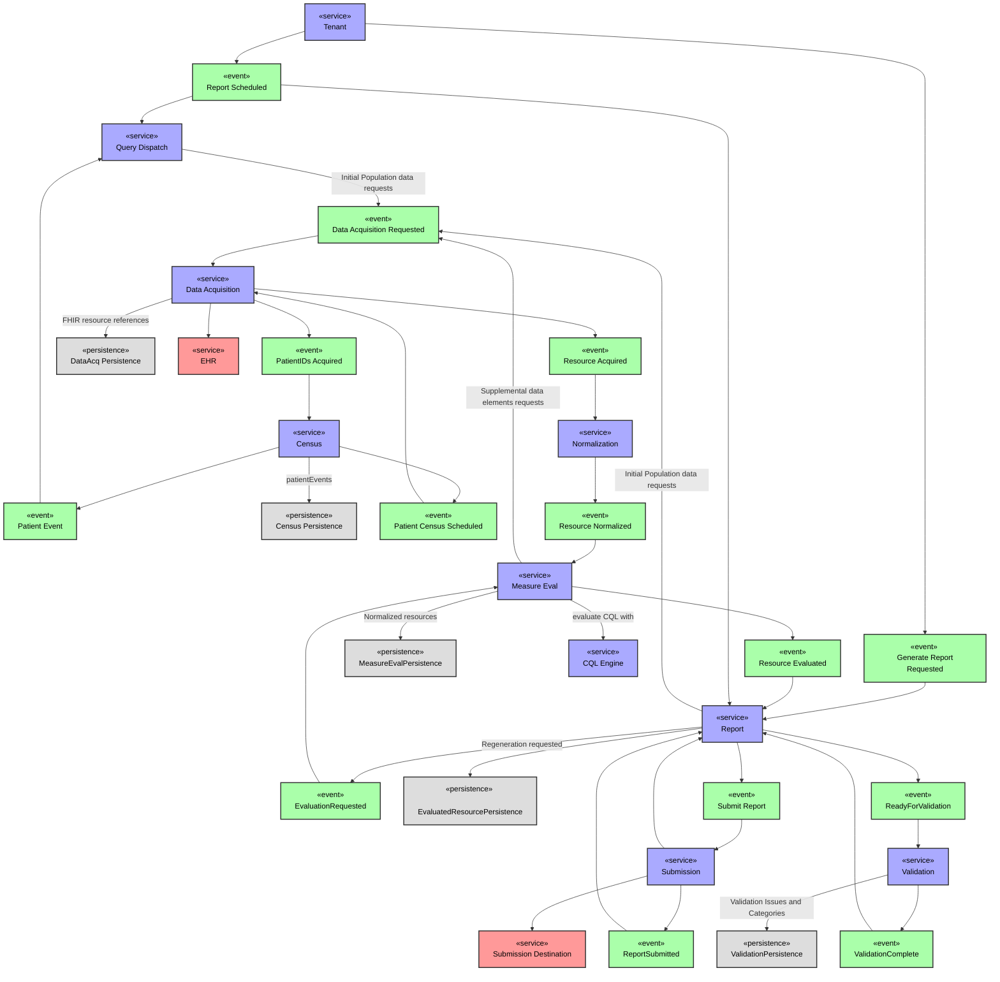

## Overview

This page and its references include documentation for Link's services and the functionality those services supports.

The following flow chart describes the critical reporting events, services and persistence-points in the Link workflow.

## [Functionality](functionality/README.md)

* [Admin UI](functionality/admin_ui.md)
* [Census Management](functionality/census_management.md)
* [Data Acquisition](functionality/data_acquisition.md)
* [Kafka Retry Topics](functionality/retry_topics.md)
* [Measure Evaluation](functionality/measure_eval.md)
* [Notifications](functionality/notifications.md)
* [Normalization](functionality/normalization.md)
* [Report](functionality/report.md)
* Security
  * [Security Overview](functionality/security_overview.md)
  * [OAuth & Cookie Flow](functionality/oauth_flow.md)
* [Submission Folder Structure](functionality/submission_folder.md)
* [Telemetry](functionality/telemetry.md)
* [Tenant/Facility Management](functionality/tenant_mgmt.md)
* [Validation](functionality/validation.md)

## Service Specifications

* [Account](service_specs/account.md)
* [Admin UI](service_specs/admin_ui.md)
* [Audit](service_specs/audit.md)
* [Backend For Frontend (BFF)](service_specs/bff.md)
* [Census](service_specs/census.md)
* [Data Acquisition](service_specs/data_acquisition.md)
* [Measure Evaluation](service_specs/measure_eval.md)
* [Normalization](service_specs/normalization.md)
* [Notification](service_specs/notification.md)
* [Query Dispatch](service_specs/query_dispatch.md)
* [Report](service_specs/report.md)
* [Submission](service_specs/submission.md)
* [Tenant](service_specs/tenant.md)
* [Validation](service_specs/validation.md)

### Development

Documentation for contributing to and developing in the Link project can be found [here](development/README.md).

### Service Swagger Specifications

When deployed, each service provides a Swagger UI for exploring its API. The Swagger UI is available at the `/swagger` endpoint for most of the services. For example, the Swagger UI for the **Account** service is available at `https://link-account/swagger`. However, the endpoint for swagger specifications varies between .NET and Java.

* .NET Services
  * UI: `/swagger`
  * JSON: `/swagger/v1/swagger.json`
* Java Services
  * UI: `/swagger-ui.html`
  * JSON: `/v3/api-docs`

## Java

### Kafka Authentication

If Kafka requires authentication (such as SASL_PLAINTEXT) the Java services use the following (example) properties:

| Property Name                             | Value                                                                                               |
|-------------------------------------------|-----------------------------------------------------------------------------------------------------|
| spring.kafka.properties.sasl.jaas.config  | org.apache.kafka.common.security.plain.PlainLoginModule required username=\"XXX\" password=\"XXX\"; |
| spring.kafka.properties.sasl.mechanism    | PLAIN                                                                                               |
| spring.kafka.properties.security.protocol | SASL_PLAINTEXT                                                                                      |

These properties can be applied when running/debugging the services locally by passing them as VM arguments, such as `-Dspring.kafka.properties.sasl.mechanism=PLAIN`.

### Azure App Config

Note: If a Java service is configured to use Azure App Config, keys in ACA take precedence over Java VM args _and_ Environment Variables.