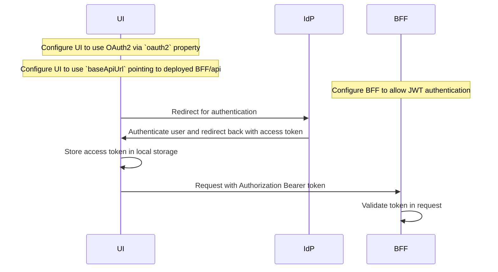
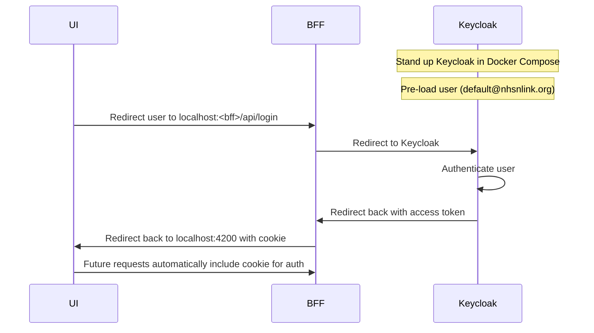
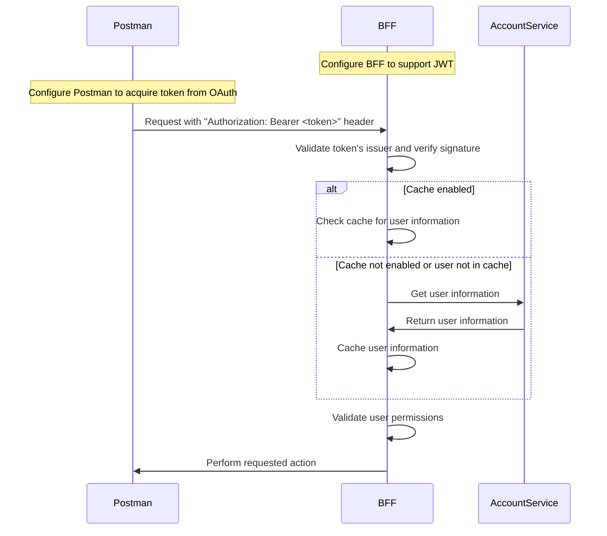

# Overview

The following documentation is specific to development practices and tools used in the Link project.

* [Authorization Policies](authorization_policies.md)
* [API Guidance](api_guidance.md)
* [Logging and Error Handling](logging_error_handling.md)
* [Open Telemetry](otel.md)

## Building and Running

### Running All Services

To run the entire stack of Link services using Docker/Compose, run the following command from the root directory:

```bash
docker compose up -d --build
```

> Note: The initial building/running of all services will take about ~10 minutes to complete.

### Running just the UI

To run the Admin UI against a deployed instance of Link's Admin BFF:

1. Create a file named `app.config.local.json` in the `Web/Admin.UI/src/assets`.
2. Run `ng serve` from the `Web/Admin.UI` directory.

The `app.config.local.json` file contains deployment-specific UI configuration, such as:

```json
{
  "baseApiUrl": "https://admin-bff-deployed-location/api",
  "authRequired": false
}
```

The above requires the following:

* Auth is _not_ required on the deployed installation of the AdminBFF.
* If auth is required, it must be configured with JWT authentication in the AdminBFF and the oauth2 section of the UI's config must be filled in.
* The deployed AdminBFF must have CORS configured to allow localhost:4200

> Note: Auth must always be enabled in production environments.

## Helpful Tools

- SQL Server Management Studio: [Link Here](https://learn.microsoft.com/en-us/sql/ssms/download-sql-server-management-studio-ssms?view=sql-server-ver16)
- Mongo Compass: [Link Here](https://www.mongodb.com/products/tools/compass)
- Mongo Shell: [Link Here](https://www.mongodb.com/docs/mongodb-shell/)
- Docker Desktop: [Link Here](https://www.docker.com/products/docker-desktop)
- Postman: [Link Here](https://www.postman.com)

## Deployment Validation and Testing

Guidance on basic tests to validate that Link is running correctly can be found [here](./testing.md).

## Docker Networking and Local Debugging

Docker Compose creates its own isolated network for containers to communicate with each other. When running services
locally in an IDE while other services are running in Docker, this network isolation can cause connectivity issues.

To enable local debugging against Docker services, Link provides a PowerShell script
`Scripts/update-windows-docker-hosts.ps1` that:

1. Identifies all running Link Docker containers
2. Updates your Windows hosts file to map service hostnames (e.g., `link-validation`) to localhost (127.0.0.1)

### Using the Script

1. First ensure all Link services are running in Docker using `docker compose up -d`
2. Run PowerShell as Administrator
3. Execute `Scripts/update-windows-docker-hosts.ps1`
4. The hosts file will be updated to allow your locally running service to resolve Docker service hostnames

This configuration is necessary when you want to debug an individual service in your IDE while having it integrate with
other services running in Docker containers.

## Useful commands

```bash
docker compose -p link up -d <services>
```

`-p` gives a custom name to the stack of services
`<services>` optionally specify individual services to start

```bash
docker compose -p link down --volumes
```

`--volumes` destroys and persisted data, including SQL tables and kafka topics/data

## Admin UI and BFF Sequences

Using separately deployed BFF with authentication:



Using BFF configured with Keycloak:



BFF is accessed directly from Postman with a token:

