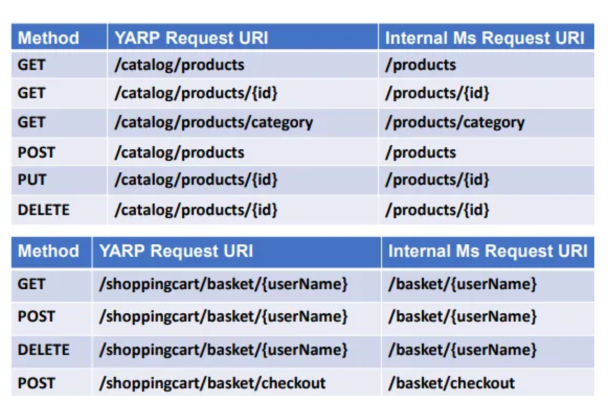

# API Guidance

Our APIs should be built with the Representational State Transfer (REST) architectural style using HTTP as the application protocol.

Each API should strive to:

- **Be Platform Independent**  
  Allow any client to leverage the API through standard protocols
- **Be Persistence Agnostic**  
  The persistence layer can be changed without any changes to the API.
- **Evolve Independently from Clients**  
  Versioning of the API to allow clients to continue to use the API in a previous state

not sure this is really necessary in our case, most of our APIs are not really for public use

- **Resource Based**  
  Every API should be designed around a resource (model representation of an object)

### API Standardization

#### Swagger

Each API should implement swagger documentation.

* [.NET](https://learn.microsoft.com/en-us/aspnet/core/tutorials/getting-started-with-swashbuckle?view=aspnetcore-8.0&tabs=visual-studio)
* [Java](https://swagger.io/tools/open-source/open-source-integrations/)

#### Versioning

Do we want to do this?

By versioning our APIs we can make breaking changes without impacting clients. When a breaking change occurs a new version of the API can be released and clients can choose when to migrate to the new version of the API and make changes necessary to work with the new version.

URL versioning can be accomplished as follows:

* `https://tenant-service/api/v1/facilities`
* `https://tenant-service/api/v2/facilities`

#### Error Response

When an error occurs in an API an HTTP response with a status code of 500 (Internal Server Error) should be returned. The body of the response should be that of a the Problem Details object. See more [here](https://datatracker.ietf.org/doc/html/rfc7807).

```json
{
  "type": "<https://tools.ietf.org/html/rfc7231#section-6.6.1>",
  "title": "An error occurred while processing your request.",
  "status": 500,
  "detail": "An error occured in our API. Please use the trace id when requesting assistence.",
  "traceId": "00-09f4ab47f959288745f3ef337ac773b7-fac718cf545d0a9d-01"
}
```

Other common error HTTP status codes include:

- 400 Bad Request - This means that client-side input fails validation.
- 401 Unauthorized - This means the user is not authorized to access a resource. It usually returns when the user isn't authenticated.
- 403 Forbidden - This means the user is authenticated, but it's not allowed to access a resource.
- 404 Not Found - This indicates that a resource is not found.
- 500 Internal server error - This is a generic server error. It probably shouldn't be thrown explicitly.
- 502 Bad Gateway - This indicates an invalid response from an upstream server.
- 503 Service Unavailable - This indicates that something unexpected happened on server side (It can be anything like server overload, some parts of the system failed, etc.).

#### Hypertext as the Engine of Application State (HATEOAS)

This concept can provide a client with additional operations that can be performed against resources associated with the request. An additional benefit to this is the API can make changes to its URI scheme without breaking clients.

Since we are using swagger, I don’t believe it is really necessary to include HATEOAS and more than likely it doesn’t make sense to use both at the same time.

Model for hypermedia links based on [RFC-8288](https://datatracker.ietf.org/doc/html/rfc8288).

##### WebLink Model

```json

{
  "rel": "resource",
  "href": "<URI of the action>",
  "action": "<HTTP Verb>",
  "types": ["<media types>"]
}
```

#### HTTP Verbs

##### \[POST\]

When a POST method will create a new resource, it will return an HTTP response with a status code of 201 (Created). The URI of the new resource will be included in the Location header of the response. The response body will contain the the APIs representation of the resource (only return the properties of the entity that has been deemed necessary for clients, exclude sensitive or internal only properties).

When a POST method does some processing, but does not create a new resource, it will return a status code of 200 and return the result of the operation in the response body. If there is no result to return that is deemed of value to the client, the endpoint can return a status code of 204 (No Content).

If a client submits a POST request with invalid data, the endpoint should return a HTTP response with a status code of 400 (Bad Request). The response body should contain additional details as to why the request was invalid.

###### Example Request: `https://tenant-service/api/facilities`

\[POST\] `https://tenant-service/api/facilities` HTTP/1.1

Content-Type: application/json; charset=utf-8

```json
{
    "facilityId": "FacilityID",
    "facilityName": "Facility Full Name"
}
```

###### Example Response

```json
{
    "id": "8f9f1e36-a969-41e0-9c8f-fbb4496b0201",
    "facilityId": "FacilityID",
    "facilityName": "Facility Full Name"
}
```

##### \[PUT\]

An endpoint that accepts a PUT request for a resource should check to see if the resource provided by the client already exists. If the resource already exists it should update that resource, however if the resource provided by the client does not exist, it should return a Problem result and not Create an entry.

If the request contains a resource that does not exist, the format of the id will also need to be checked. If the format of the id provided does not match the UUID format that has been decided on for the resource then the API should return an HTTP response with a status code of 400 (Bad Request). The response body should contain a message that states “Invalid Id format”.

When a PUT request updates an existing resource, it will return an HTTP response with a status code of 202 (Accepted).

The request body should be a resource with an id element that has an identical value to the id in the URL. If no id element is provided, or the id does not match with the id in the URL, the endoint will return with a status code of 400 (Bad Request).

###### Example Request: `https://tenant-service/api/facilities/{{id}}`

PUT `https://tenant-service/api/facilities/deba542d-0c75-449e-bea4-30671a9d7d9e` HTTP/1.1

Content-Type: application/json; charset=utf-8

```json
{
  "id": "deba542d-0c75-449e-bea4-30671a9d7d9e",
  "facilityId": "FacilityID",
  "facilityName": "Facility Full Name"
}
```

##### \[PATCH\]

TBD if use cases exist for this

##### \[GET\]

When a GET request successfully retrieves the resource asked for, it will return an HTTP status code of 200 (OK). The response body will contain the the APIs representation of the resource (only return the properties of the entity that has been deemed necessary for clients, exclude sensitive or internal only properties).

If the resource requested cannot be found, the response should be an HTTP status code for 404 (Not Found).

An interesting security discussion probably should happen around the Ids used. If the resource is sensitive, account for example, it is a good idea to use a UUID instead of something like an incremented identity column. Even string based identifiers can be problematic.  
<br/>The reason for this is with incremented identifiers and string based names a user can make fairly good guesses of other Ids they can put int he request. This can be used for malicious intent as responses like Not Found or Unauthorized is useful information. If I get a Unauthorized I know that Id exists for instance. Then you can use that information to try other methods such as social engineering.

###### Example Request: `https://tenant-service/api/facilities/{{id}}`

GET `https://tenant-service/api/facilities/deba542d-0c75-449e-bea4-30671a9d7d9e` HTTP/1.1

Content-Type: application/json; charset=utf-8

###### Example Response

```json
{
    "id": "deba542d-0c75-449e-bea4-30671a9d7d9e",
    "facilityId": "FacilityID",
    "facilityName": "Facility Full Name",
}
```

If the request is made to an endpoint that performs a search, it will return an HTTP status code of 200 (OK). The response body will contain a PagedListModel that contains an array of the resource model and a PagedMetadata object.

If the request is made to an endpoint that performs a search and no results were found, it should return an HTTP status code of 204 (No Content).

###### PagedModel Interface

```csharp
public interface IPagedModel<T> where T : class
{
    public List<T> Records { get; set; }
    public PaginationMetadata Metadata { get; set; }
}
```

###### PaginationMetadata Interface

```csharp
public interface IPaginationMetadata
{
    int PageSize { get; }
    int PageNumber { get; }
    long TotalCount { get; }
}
```

###### Example of a concrete implementation in the Demo API Gateway

```csharp
public class PaginationMetadata : IPaginationMetadata
{
    public int PageSize { get; set; }
    public int PageNumber { get; set; }
    public long TotalCount { get; set; }
    public long TotalPages { get; set; }
    public PaginationMetadata() { }
    
    public PaginationMetadata(int pageSize, int pageNumber, long totalCount)
    {
        PageSize = pageSize;
        PageNumber = pageNumber;
        TotalCount = totalCount;
        TotalPages = (int)Math.Ceiling(totalCount / (double)pageSize);
    }
}
```

###### Example Request: `https://tenant-service/api/facilities?pageSize=10&pageNumber=1`

GET `https://tenant-service/api/facilities?pageSize=10&pageNumber=1` HTTP/1.1

Content-Type: application/json; charset=utf-8

###### Example Response

```json
{
    "records": [{
        "id": "1029c167-4a9b-42f5-9f8b-dc82eb301a3f",
        "facilityId": "FacilityId1",
        "facilityName": "Facility 1 Full Name",
    },
    {
        "id": "7240fc1b-fce9-4d88-ab98-90e4fb1715e2",
        "facilityId": "FacilityId2",
        "facilityName": "Facility 2 Full Name",
    }],
    "metadata": {
        "pageSize": 10,
        "pageNumber": 1,
        "totalCount": 2,
        "totalPages": 1
    }
}
```

How do we want to handle UI concerns such as populating drop down lists with key value pairs? Do we want to create custom endpoints that return only the needed key value pair. Do we want to use a GET baseUrl/resource that will return a subset of resource data and then the UI would map it to a key value pair model?

##### DELETE

When a DELETE request successfully removes a resource, it will return an HTTP response with a status code of 204 (No Content).

###### Example Request: `https://tenant-service/api/facilities/{{id}}`

DELETE `https://tenant-service/api/facilities/deba542d-0c75-449e-bea4-30671a9d7d9e` HTTP/1.1

Content-Type: application/json; charset=utf-8

### HTTP Clients

Typed clients can be created for each underlying service the API will be communicating with. This use of the HttpClientFactory helps prevent build up of underlying network sockets that are not immediately released with a HttpClient is disposed. See more [here](https://learn.microsoft.com/en-us/dotnet/architecture/microservices/implement-resilient-applications/use-httpclientfactory-to-implement-resilient-http-requests).

#### Typed Client Interface

```csharp
namespace LantanaGroup.Link.DemoApiGateway.Services.Client
{
    public interface INotificationService
    {
        Task<HttpResponseMessage> ListNotifications(string? searchText, string? filterFacilityBy, string? filterNotificationTypeBy, DateTime? createdOnStart, DateTime? createdOnEnd, DateTime? sentOnStart, DateTime? sentOnEnd, string? sortBy, int pageSize = 10, int pageNumber = 1);
        Task<HttpResponseMessage> CreateNotification(NotificationMessage model);
        Task<HttpResponseMessage> ListConfigurations(string? searchText, string? filterFacilityBy, string? sortBy, int pageSize = 10, int pageNumber = 1);
        Task<HttpResponseMessage> CreateNotificationConfiguration(NotificationConfigurationModel model);
        Task<HttpResponseMessage> UpdateNotificationConfiguration(NotificationConfigurationModel model);
        Task<HttpResponseMessage> DeleteNotificationConfiguration(Guid id);
    }
}
```

#### Typed Client Implementation

```csharp
namespace LantanaGroup.Link.DemoApiGateway.Services.Client
{
    public class NotificationService : INotificationService
    {
        private readonly HttpClient _httpClient;
        private readonly IOptions<GatewayConfig> _gatewayConfig;
        
        public NotificationService(HttpClient httpClient, IOptions<GatewayConfig> gatewayConfig)
        {
            _httpClient = httpClient ?? throw new ArgumentNullException(nameof(httpClient));
            _gatewayConfig = gatewayConfig ?? throw new ArgumentNullException(nameof(\_gatewayConfig));
        }
            
        public async Task<HttpResponseMessage> CreateNotification(NotificationMessage model)
        {
            _httpClient.BaseAddress = new Uri(_gatewayConfig.Value.NotificationServiceApiUrl);
            _httpClient.DefaultRequestHeaders.Accept.Clear();
            _httpClient.DefaultRequestHeaders.Accept.Add(new MediaTypeWithQualityHeaderValue("application/json"));
            
            // HTTP GET
            HttpResponseMessage response = await _httpClient.PostAsJsonAsync($"api/notification", model);
            return response;
        }
    }
}
```

#### Adding typed services

```csharp
builder.Services.AddHeaderPropagation(opts => {
    opts.Headers.Add("Authorization");
});

builder.Services.AddHttpClient<INotificationService, NotificationService>();
```

### Header Propagation

Header propagation allows you to add a header value from an incoming request to a request made by the receiving API. The most likely example of this would be an authorization header.

#### Adding the typed client and Header Propagation

##### [NuGet package](https://www.nuget.org/packages/Microsoft.AspNetCore.HeaderPropagation/)

dotnet add package Microsoft.AspNetCore.HeaderPropagation --version 7.0.8

##### Adding header propagation to services

```csharp
builder.Services.AddHeaderPropagation(opts => {
    opts.Headers.Add("Authorization");
});

builder.Services.AddHttpClient<INotificationService, NotificationService>().AddHeaderPropagation();
```

Header propagation will automatically add specified headers to the http client connections to underlying services. In this example we are propagating the Authorization header that contains the bearer token from the client request. See more [here](https://learn.microsoft.com/en-us/dotnet/api/microsoft.extensions.dependencyinjection.headerpropagationservicecollectionextensions.addheaderpropagation?view=aspnetcore-7.0).

#### Using the typed clients

```csharp
namespace LantanaGroup.Link.DemoApiGateway.Controllers
{
    [Route("api/notification")]
    [ApiController]
    public class NotificationGatewayController : ControllerBase
    {
        private readonly ILogger<NotificationGatewayController> _logger;
        private readonly INotificationService _notificationService;
        private int maxPageSize = 20;
        
        public NotificationGatewayController(ILogger<NotificationGatewayController> logger, INotificationService notificationService)
        {
            _logger = logger ?? throw new ArgumentNullException(nameof(logger));
            _notificationService = notificationService ?? throw new ArgumentNullException(nameof(notificationService));
        }
        
        [HttpGet]
        public async Task<ActionResult<PagedNotificationModel> ListNotifications(string? searchText, string? filterFacilityBy, string? filterNotificationTypeBy, DateTime? createdOnStart, DateTime? createdOnEnd, DateTime? sentOnStart, DateTime? sentOnEnd, string? sortBy, int pageSize = 10, int pageNumber = 1)
        {
            //TODO check for authorization
            try
            {
                //make sure page size does not exceed the max page size allowed
                if (pageSize > maxPageSize) { pageSize = maxPageSize; }
                if (pageNumber < 1) { pageNumber = 1; }
                
                //Get list of audit events using supplied filters and pagination
                HttpResponseMessage response = await _notificationService.ListNotifications(searchText, filterFacilityBy, filterNotificationTypeBy, createdOnStart, createdOnEnd, sentOnStart, sentOnEnd, sortBy, pageSize, pageNumber);
                
                if (response.IsSuccessStatusCode)
                {
                
                    var notificationtList = await response.Content.ReadFromJsonAsync<PagedNotificationModel>();
                    
                    if (notificationtList == null) { return NotFound(); }
                    
                    //add X-Pagination header for machine-readable pagination metadata
                    Response.Headers.Add("X-Pagination", JsonSerializer.Serialize(notificationtList.Metadata));
                    return Ok(notificationtList);
                }
                else
                {
                    return NotFound();
                }
            }
            catch (Exception ex)
            {
                _logger.LogError(new EventId(LoggingIds.ListItems, "List Notifiations"), ex, "An exception occurred while attempting to retrieve notifications.");
                return StatusCode(500, ex);
            }
        }
    }
}
```

### Route Guidelines

**1\. Remove component name from route**

To simplify route definitions, the URL within the request should be a sufficient indicator on which Link Cloud component is being accessed.

| **Incorrect**                            | **Correct**                     |
|------------------------------------------|---------------------------------|
| `/api/census/config`                     | `/config`                       |
| `/api/data/{facilityId}/{queryPlanType}` | `/{facilityId}/{queryPlanType}` |

External requests to the Link Admin service will still need to contain the service as part of the request route in order for the service to able to redirect the request to the correct service.



For example, the Census service route to update a facility config is:

External request: `/api/census/configs/facilities/{facilityId}`

Internal service route: `/configs/facilities/{facilityId}`

The following Link Admin (BFF) appSettings includes the following to create this route proxy:

```json
"route3": {
  "ClusterId": "CensusService",
  "AuthorizationPolicy": "AuthenticatedUser",
  "Match": {
    "Path": "api/census/{**catch-all}"
  },
  "Transforms": [
    { "PathPattern": "/{**catch-all}" }
  ]
},
```

**2\. Plural nouns**

Unless they are singleton resources, nouns in the API route should be plural.

| **Incorrect**                     | **Correct**                            |
|-----------------------------------|----------------------------------------|
| `/api/census/config/{facilityId}` | `/api/configs/facilities/{facilityId}` |

**3\. Lower case route**

API routes are case-sensitive. Because of this, routes should be lower case to remove any confusion.

| **Incorrect**              | **Correct**                     |
|----------------------------|---------------------------------|
| `/api/ReportConfig/Create` | `/api/reportconfig/create`<br/> |

**4\. Hyphenate to separate words rather than using spaces/camel case/pascal case**

This practice improves readability and ensures compatibility across different systems and platforms.

| **Incorrect**                                   | **Correct**                                       |
|-------------------------------------------------|---------------------------------------------------|
| `/api/data/{facilityId}/fhirQueryConfiguration` | `/api/data/{facilityId}/fhir-query-configuration` |

**5. When applicable, service configurations should be capable of making requests with both the identifier of the record and Facility Id**

Often services support configuration related requests either by identifier or facility. When applicable, a service should be capable of updating with either identifier. For example, the following PUT requests can be made to update a census config:

- `/configs/facilities/{facilityId}`
- `/configs/{Id}`

## Additional Resources

* [Authorization Policies](./authorization_policies.md)
* [Logging and Error Handling (TODO)](./logging_error_handling.md)
* [Telemetry (TODO)](./telemetry.md)