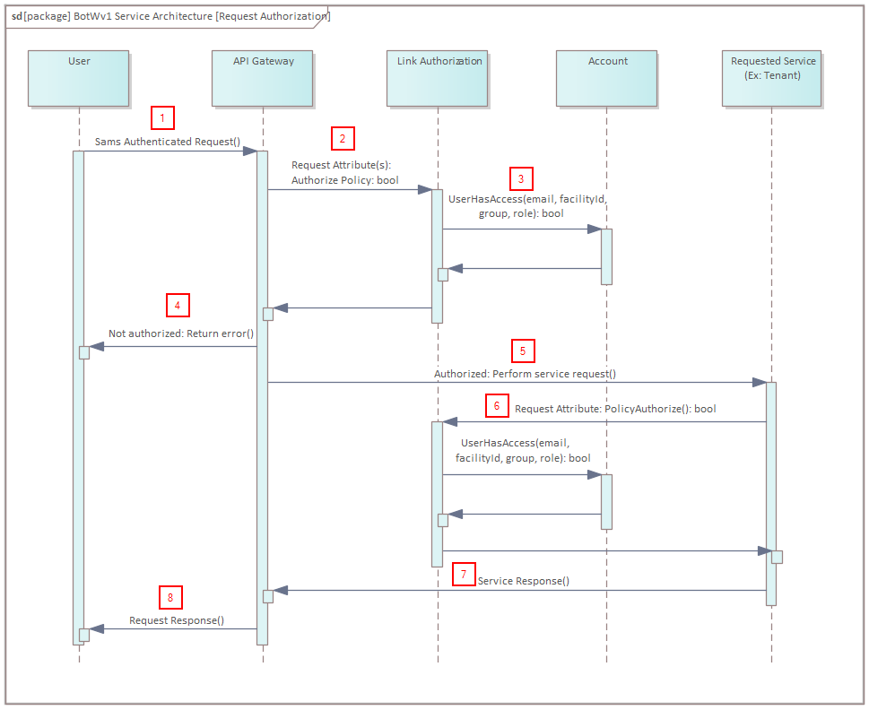

# Authorization Policies

Link will enforce developer constructed authorization policies to ensure that users have the proper access required before performing any requests. This will help prevent users from having the ability to perform CRUD operations on service data or configurations without having the necessary permissions set by the facility administrators to do so. Authorization policies will be enforced both at the API Gateway and at each individual service.

## Request Authorization Sequence



1. User performs initial request. Authentication will have been completed at this point and the request will contain a JWT Token. The API Gateway has an endpoint for the request that contains authorization policies.
2. The policy extracts the email address of the user from the JWT Token and performs a request to the Account services' UserHasAccess endpoint. This Account endpoint requires that **all** policies pass the following parameters to determine if they have the proper permissions for the request:
    1. Email
    2. Facility Id
    3. Account Group
    4. Account Role
3. The Account service returns a bool value on whether the user is authorized for the request.
4. If the response returns a false, the API Gateway should return an error code (Potentially 401 Unauthorized).
5. If the response returns a true, the API Gateway will make the request to the service.
6. As a safety precaution, the service will perform the same authorization policy checks that the API Gateway endpoint did (Step 3).
7. The service will then send a response based on the request of the service.
8. The API Gateway will return the response back to the user.

## Authorization Library

All authorization policies will be located under the Link.Authorization project in the .NET solution (AuthorizationPolicy.cs):

```csharp
using Microsoft.AspNetCore.Authorization;

namespace Link.Authorization
{
  public static class AuthorizationPolicies
  {
    public static AuthorizationPolicy CanViewAuditLogs()
    {
      //TODO: Add Account Authorization Requirement functionality to support Account UserHasAccess()
      return new AuthorizationPolicyBuilder()
        .RequireAuthenticatedUser()
        .RequireRole("LinkAdministrator")
        .Build();
    }

    public static AuthorizationPolicy CanCreateNotifiactionConfigurations()
    {
      return new AuthorizationPolicyBuilder()
        .RequireAuthenticatedUser()
        .RequireRole("LinkAdministrator")
        .Build();
    }
  }
}
```

A policy must be registered by the service in Program.cs in order to be used.Below is an example of policies that have been registered
for use in the API Gateway project:

```csharp
  builder.Services.AddAuthorization(authorizationOptions => {
    authorizationOptions.AddPolicy("UserCanViewAuditLogs", AuthorizationPolicies.CanViewAuditLogs());
    authorizationOptions.AddPolicy("CanCreateNotifiactionConfigurations", AuthorizationPolicies.CanCreateNotifiactionConfigurations());
    authorizationOptions.AddPolicy("CanUpdateNotifiactionConfigurations", AuthorizationPolicies.CanUpdateNotifiactionConfigurations());
    authorizationOptions.AddPolicy("CanDeleteNotifiactionConfigurations", AuthorizationPolicies.CanDeleteNotifiactionConfigurations());
    authorizationOptions.AddPolicy("ClientApplicationCanRead", policyBuilder => {
      policyBuilder.RequireScope("demogatewayapi.read");
    });
    authorizationOptions.AddPolicy("ClientApplicationCanCreate", policyBuilder => {
      policyBuilder.RequireScope("demogatewayapi.write");
    });
    authorizationOptions.AddPolicy("ClientApplicationCanDelete", policyBuilder => {
      policyBuilder.RequireScope("demogatewayapi.delete");
    });
```

Once a Policy has been registered to the service, it can then be enforced by adding the following attribute to the request endpoint:

```csharp
[HttpGet]
[Authorize(Policy = "UserCanViewAuditLogs")]
[Authorize(Policy = "ClientApplicationCanRead")]
public async Task <ActionResult<PagedAuditModel>> ListAuditEvents()
{
  //code
}
```

As shown in the example, multiple Policies can be applied to a single request.