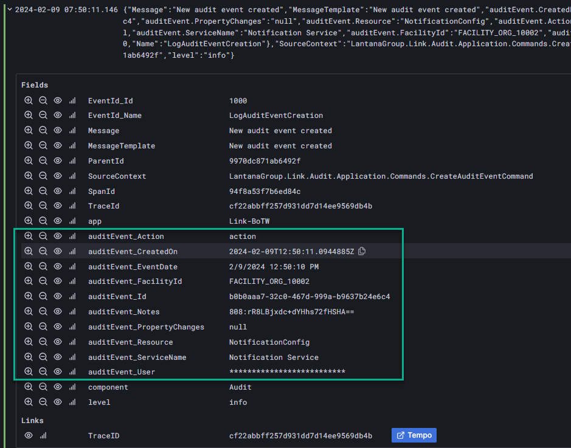
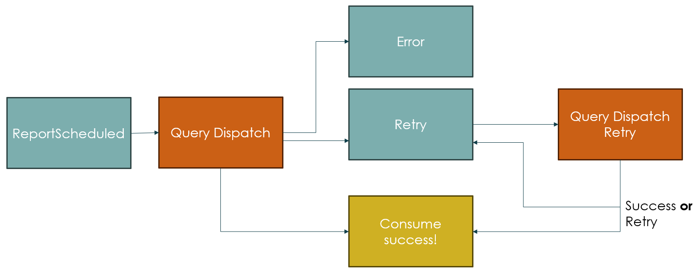

## Setting up SeriLog

To set up SeriLog to capture the desired logging information you will need to have the following NuGet packages installed:

- [Serilog AspNetCore](https://www.nuget.org/packages/Serilog.AspNetCore)
    - `dotnet add package Serilog.AspNetCore`
- [Serilog Loki](https://www.nuget.org/packages/Serilog.Sinks.Grafana.Loki)
    - `dotnet add package Serilog.Sinks.Grafana.Loki`
- [Serilog Exceptions](https://www.nuget.org/packages/Serilog.Exceptions/)
    - `dotnet add package Serilog.Exceptions`
- [Serilog Encrichers Span](https://www.nuget.org/packages/Serilog.Enrichers.Span)
    - `dotnet add package Serilog.Enrichers.Span`
- [Serilog Expressions](https://www.nuget.org/packages/serilog.expressions)
    - `dotnet add package Serilog.Expressions`

To configure SeriLog, in the RegisterServices method in the service startup (Program.cs) add the following:

```csharp
// Logging using Serilog
builder.Logging.AddSerilog();
var loggerOptions = new ConfigurationReaderOptions { SectionName = AuditConstants.AppSettingsSectionNames.Serilog };    
Log.Logger = new LoggerConfiguration()
                .ReadFrom.Configuration(builder.Configuration, loggerOptions)
                .Filter.ByExcluding("RequestPath like '/health%'")
                .Enrich.WithExceptionDetails()
                .Enrich.FromLogContext()
                .Enrich.WithSpan()                  
                .Enrich.With<ActivityEnricher>()
                .CreateLogger();

//Serilog.Debugging.SelfLog.Enable(Console.Error); 
```

You can add additional filters to exclude certain request paths you don’t want captured in logging (swagger for example).

Next add the following to appsettings.json

```json
"Link:Audit:Logging:Serilog": {
  "Using": [ "Serilog.Sinks.Console", "Serilog.Sinks.Grafana.Loki" ],
  "MinimumLevel": {
    "Default": "Information",
    "Override": {
      "Microsoft": "Warning",
      "System": "Warning"
    }
  },
  "WriteTo": [
    { "Name": "Console" },
    {
      "Name": "GrafanaLoki",
      "Args": {
        "uri": "http://localhost:3100",
        "labels": [
          {
            "key": "app",
            "value": "Link-BoTW"
          },
          {
            "key": "component",
            "value": "Audit"
          }
        ],
        "propertiesAsLabels": [ "app", "component" ]
      }
    }
  ]
}
```

Additionally you can add the following to enhance the format of the console:

```json
"Logging": {
    "LogLevel": {
      "Default": "Information",
      "Microsoft": "Warning",
      "System": "Warning"
    },
    "Console": {
      "FormatterName": "json",
      "FormatterOptions": {
        "SingleLine": true,
        "IncludeScopes": true,
        "TimestampFormat": "HH:mm:ss ",
        "UseUtcTimestamp": true,
        "JsonWriterOptions": {
          "Indented": true
        }
      }
    }
  }
```

## Adding Problem Details

Problem details is an attempt at an industry standard to carry machine readable details of errors in a HTTP response to avoid the need to define new error response formats for HTTP APIs.

[RFC-7807](https://datatracker.ietf.org/doc/html/rfc7807)

This can be accomplished by using the .NET [problem details service](https://learn.microsoft.com/en-us/aspnet/core/web-api/handle-errors?view=aspnetcore-7.0#problem-details-service).

To enable to sending of Problem Details add the following in the RegisterServices method in the service startup (Program.cs):

```csharp
//Add problem details
builder.Services.AddProblemDetails(options => {
    options.CustomizeProblemDetails = ctx =>
    {            
        ctx.ProblemDetails.Detail = "An error occured in our API. Please use the trace id when requesting assistence.";
        if (!ctx.ProblemDetails.Extensions.ContainsKey("traceId"))
        {
            string? traceId = Activity.Current?.Id ?? ctx.HttpContext.TraceIdentifier;
            ctx.ProblemDetails.Extensions.Add(new KeyValuePair<string, object?>("traceId", traceId));
        }      

        if (builder.Environment.IsDevelopment())
        {
            ctx.ProblemDetails.Extensions.Add("service", "Audit");
        }
        else 
        {
            ctx.ProblemDetails.Extensions.Remove("exception");
        }
        
    };                        
});
```

Add the following to the SetupMiddleware method in the service startup (Program.cs):

```csharp
if (app.Environment.IsDevelopment() || app.Environment.EnvironmentName.Equals("Local", StringComparison.InvariantCultureIgnoreCase))
{
    app.UseDeveloperExceptionPage();
}
else
{
    app.UseExceptionHandler();
}
```

This will consume any 500 error returned by the API and turn it into a ProblemDetails model that is returned to the user. It will appear as follows:

```json
{
    "type": "https://httpstatuses.io/500",
    "title": "Internal Server Error",
    "status": 500,
    "detail": "An error occured in our API. Please use the trace id when requesting assistence.",
    "traceId": "00-09f4ab47f959288745f3ef337ac773b7-fac718cf545d0a9d-01"
}
```

We can use the Trace Id to find relevant logs pertaining to the issue.

For this to work correctly you will need to return a 500 response type along with the exception in your API.

```csharp
catch (Exception ex)
{
    _logger.LogError(new EventId(LoggingIds.GetItem, "Get Audit Event"), ex, "An exception occurred while attempting to retrieve an audit event with an id of {id}", id);
    throw;
}
```

## Logging Ids

The AuditLoggingIds.GetItem in the above \_logger.LogError method is a new option in .NET that allows you to assign a Logging Id to log types. In the example above it will give the log an id of 1002 from the following static class.

```csharp
public static class AuditLoggingIds 
{
    public const int GenerateItems = 1000;
    public const int ListItems = 1001;
    public const int GetItem = 1002;
    public const int InsertItem = 1003;
    public const int UpdateItem = 1004;
    public const int DeleteItem = 1005;      
    public const int GetItemNotFound = 1006;
    public const int UpdateItemNotFound = 1007;
    public const int EventConsumer = 2000;
    public const int EventProducer = 2001;
    public const int HealthCheck = 9000;
}
```

This can allow for finding specific log types by the id and will show up in logs as follows:


## UserScope Middleware

The LantanaGroup.Link.Shared.Application.Middleware middleware has been added to the shared project. This middleware will capture the username as well as the id of the user if an authenticated user is present in the .NET HttpContext.User.Identity object. This object will be populated based on if/how you have authentication enabled. For more information about enabled authentication see TBD.

This scoped user information will automatically be added to any logs created. To add the middleware simply add the following in the SetupMiddleware method in the service startup (Program.cs):

```csharp
app.UseRouting();
app.UseCors("CorsPolicy");
app.UseAuthentication();
app.UseMiddleware<UserScopeMiddleware>();
app.UseAuthorization();    
app.UseEndpoints(endpoints => endpoints.MapControllers());   
```

This middlware should come after app.UseAuthentication(). When this is added the following will be included in a scope within your logs.


## Adding data to exceptions

For additional context, you may add some additional data about the issue that caused the exception to be thrown as follows:

```csharp
catch (NullReferenceException ex)
{
    _logger.LogDebug(new EventId(LoggingIds.GetItem, "Get Audit Event"), ex, "Failed to get audit event with an id of {id}.", id);
    var queryEx = new ApplicationException("Failed to get audit event", ex);
    queryEx.Data.Add("Id", id);
    throw queryEx;
}
```

The `exception.Data.Add()` method will add this information in the following locations:


Additional information about .NET logging can be found [here](https://learn.microsoft.com/en-us/aspnet/core/fundamentals/logging/?view=aspnetcore-7.0).

## LoggerMessage Attribute

Introduced in .NET 6, the [LoggerMessage](https://learn.microsoft.com/en-us/dotnet/core/extensions/logger-message-generator) allows for performant logging.

```csharp
public static partial class Logging
{
    [LoggerMessage(
      AuditLoggingIds.GenerateItems, 
      LogLevel.Information, 
      "New audit event created")]
    public static partial void LogAuditEventCreation(this ILogger logger, 
      [LogProperties]AuditEntity auditEvent);
}
```

The `LogProperties` attribute, requires .NET 8, will include all of the properties of the object in your log.



## Kafka Consumer Error Handling

When consuming an event that cannot be deserialized, the consumer should catch the error through a ConsumeException. In the catch, the service should do the following:

* Create an audit event to trace that an error occurred.
* Produce an error event to the Error topic. Storing improperly structured events in an separate topic will allow for further investigate
* Commit the consumer result to acknowledge back to the Kafka broker that the consumed event was processed.


Example:

```csharp
ConsumeResult<ReportScheduledKey, ReportScheduledValue> consumeResult;
try 
{
    consumeResult = _reportScheduledConsumer.Consume(cancellationToken);
}
catch (ConsumeException e)
{
    _logger.LogError($"Consume failure, potentially schema related: {e.Error.Reason}");
    var potentialFacilityId = Encoding.UTF8.GetString(e.ConsumerRecord.Message.Key);
    var potentialValue = Encoding.UTF8.GetString(e.ConsumerRecord.Message.Value);

    ProduceErrorEvent(potentialFacilityId, potentialValue);

    var auditValue = new AuditEventMessage
    {
        FacilityId = potentialFacilityId,
        Action = AuditEventType.Query,
        ServiceName = "QueryDispatch",
        EventDate = DateTime.UtcNow,
        Notes = $"Kafka ReportScheduled consume failure, potentially schema related \nException Message: {e.Error}",
    };

    ProduceAuditEvent(auditValue, e.ConsumerRecord.Message.Headers);

    _reportScheduledConsumer.Commit();

    continue;
}
```

```csharp
private void ProduceErrorEvent(string key, string value) {
  var config = new ProducerConfig()
  {
      ClientId = "Error-QueryDispatch-ReportScheduled"
  };

  using (var producer = _errorProducerFactory.CreateProducer(config)) 
  {
      var headers = new Headers
      {
          new Header("X-Consumer", Encoding.UTF8.GetBytes("QueryDispatch")),
          new Header("X-Topic", Encoding.UTF8.GetBytes("ReportScheduledEvent"))
      };

      producer.Produce("Error", new Message<string, string> 
      { 
          Key = key,
          Value = value,
          Headers = headers
      });

      producer.Flush();
  }
}
```

Kafka Consumer Retry Handling

When a problem occurs while processing a consumed event (Facility not properly configured, API connection could not be established, could not connect to database, etc), we will want to attempt to perform retries to ensure that BotW processes each event successfully. When an exception is caught during the processing of an event, the service should do the following:

* Create an audit event to trace that an error occurred.
* Produce a retry event to the services Retry topic. 
* Commit the consumer result to acknowledge back to the Kafka broker that the consumed event was processed.

