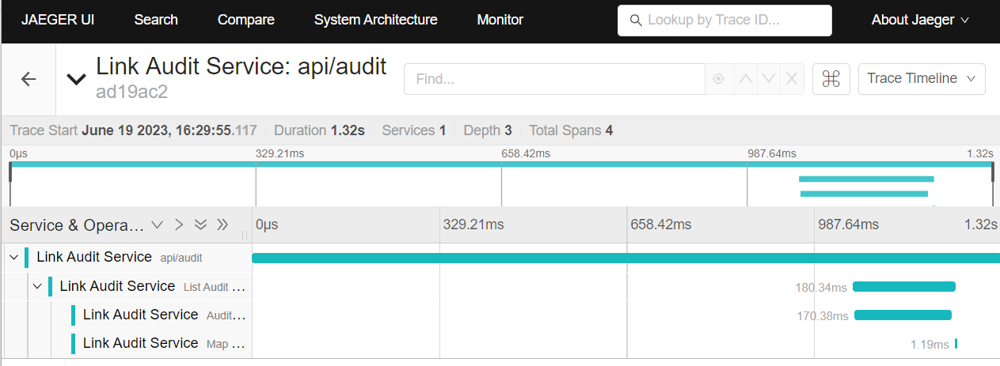

# Open Telemetry

In Link we will leverage [Open Telemetry](https://opentelemetry.io/docs/what-is-opentelemetry/) to capture important tracing, metrics and other logging to better design and maintain distributed services.

## Setting up OpenTelemetry

There is a great guide [here](https://opentelemetry.io/docs/instrumentation/net/getting-started/) , but to get started you will need to add the following core NuGet packages:

- https://www.nuget.org/packages/OpenTelemetry.Exporter.Console
- https://www.nuget.org/packages/OpenTelemetry.Extensions.Hosting
- https://www.nuget.org/packages/OpenTelemetry.Instrumentation.AspNetCore/1.0.0-rc9.14
- https://www.nuget.org/packages/OpenTelemetry.Exporter.OpenTelemetryProtocol

Depending on the functionality your service provides you may have interest in adding these additional packages:

- https://www.nuget.org/packages/Confluent.Kafka.Extensions.OpenTelemetry/0.2.0?_src=template
- https://www.nuget.org/packages/MongoDB.Driver.Core.Extensions.OpenTelemetry
- https://www.nuget.org/packages/OpenTelemetry.Instrumentation.Http/1.0.0-rc9.14
- https://www.nuget.org/packages/OpenTelemetry.Instrumentation.GrpcNetClient/1.5.1-beta.1
- https://www.nuget.org/packages/OpenTelemetry.Instrumentation.Runtime/1.5.0?_src=template
- https://www.nuget.org/packages/OpenTelemetry.Instrumentation.Process/

You can view additional packages [here](https://www.nuget.org/packages?q=opentelemetry&frameworks=&tfms=&packagetype=&prerel=true&sortby=relevance) or [here](https://opentelemetry.io/ecosystem/registry/?s=.net&component=&language=).

## Service Configuration

Add the following configuration items to set up service name and version.

```csharp
public class ServiceInformation
{
    public string Name { get; set; } = string.Empty;
    public string Version { get; set; } = string.Empty;
}
```

Add the following to appsettings.json:

```json
"ServiceInformation": {
  "Name": "Link Audit Service",
  "Version": "1.1.0-beta"
},
```

Once these configuration settings are in place add the following to the service startup (Program.cs): 

```csharp
var serviceInformation = builder.Configuration.GetSection(AuditConstants.AppSettingsSectionNames.ServiceInformation).Get<ServiceInformation>();
if (serviceInformation != null)
{
    ServiceActivitySource.Initialize(serviceInformation);
    Counters.Initialize(serviceInformation);
}
else
{
    throw new NullReferenceException("Service Information was null.");
}
```

## Telemetry Configuration

Add the following configuration items to enable greater portability of your service:

```csharp
public class TelemetryConfig
{
    public bool EnableTracing { get; set; } = true;
    public bool EnableMetrics { get; set; } = true;
    public bool EnableRuntimeInstrumentation { get; set; } = false;
    public string TraceExporterEndpoint { get; set; } = string.Empty;
    public string MetricsEndpoint { get; set; } = string.Empty;
    public string TelemetryCollectorEndpoint { get; set; } = string.Empty;
}
```

Add the following to appsettings.json:

```json
"TelemetryConfig": {
  "EnableRuntimeInstrumentation": false,
  "TraceExporterEndpoint": "http://localhost:4317/",
  "MetricsEndpoint": "http://localhost:9101",
  "TelemetryCollectorEndpoint": "http://localhost:4317"
},
```

The TraceExporterEndpoint and MetricsEndpoint are only used if you want to connect directly to a Tracing service like <https://www.jaegertracing.io/> or a metrics scraper like <https://prometheus.io/>. The TelemetryCollectorEndpoint should be what you are targeting for any moving beyond your local development environment.

Next you will need to add the TelemetryConfig to your service constants:

Once these configuration settings are in place add the following to the service startup (Program.cs) or within an IServiceCollection extension:

```csharp
var telemetryConfig = builder.Configuration.GetSection(NotificationConstants.AppSettingsSectionNames.Telemetry).Get<TelemetryConfig>();
  if (telemetryConfig != null)
  {
      var otel = builder.Services.AddOpenTelemetry();
      
      //configure OpenTelemetry resources with application name
      otel.ConfigureResource(resource => resource
          .AddService(
              serviceName: ServiceActivitySource.Instance.Name, 
              serviceVersion: ServiceActivitySource.Instance.Version
          ));  
      
      otel.WithTracing(tracerProviderBuilder =>
              tracerProviderBuilder
                  .AddSource(ServiceActivitySource.Instance.Name)
                  .AddAspNetCoreInstrumentation(options =>
                      {
                          options.Filter = (httpContext) => httpContext.Request.Path != "/health"; //do not capture traces for the health check endpoint
                      })
                  .AddConfluentKafkaInstrumentation()
                  .AddOtlpExporter(opts => { opts.Endpoint = new Uri(telemetryConfig.TelemetryCollectorEndpoint); }));
      
      otel.WithMetrics(metricsProviderBuilder =>
              metricsProviderBuilder
                  .AddAspNetCoreInstrumentation()
                  .AddProcessInstrumentation()                        
                  .AddMeter("LinkAuditService")
                  .AddOtlpExporter(opts => { opts.Endpoint = new Uri(telemetryConfig.TelemetryCollectorEndpoint); }));
      
      if(telemetryConfig.EnableRuntimeInstrumentation)
      {
          otel.WithMetrics(metricsProviderBuilder =>
              metricsProviderBuilder
                  .AddRuntimeInstrumentation());
      }
      
      if (builder.Environment.IsDevelopment())
      {
          otel.WithTracing(tracerProviderBuilder =>
              tracerProviderBuilder
              .AddConsoleExporter());
      
          //metrics are very verbose, only enable console exporter if you really want to see metric details
          //otel.WithMetrics(metricsProviderBuilder =>
          //    metricsProviderBuilder
          //        .AddConsoleExporter());                
      }        
  }
```

The first line will need to be adjusted to retrieve your services TelemetryConfiguration

```csharp
var telemetryConfig = builder.Configuration.GetSection(<ServiceConstants>.AppSettingsSectionNames.Telemetry).Get<TelemetryConfig>();
```

You will also need to create the `ServiceActivitySource`.

DiagnosticNames

This static class ensures consistency across services when adding tags to activities, metrics, and tracing.

## Creating a root activity

It is best practice to create a static root source activity that will be used to build all child activities. 

```csharp
public static class ServiceActivitySource
{
    private static string _version = string.Empty;
    public static string ServiceName = "Link Audit Service";
    public static ActivitySource Instance { get; private set; } = new ActivitySource(ServiceName, _version);

    public static void Initialize(ServiceInformation serviceInfo)
    {
        ServiceName = serviceInfo.Name;
        _version = serviceInfo.Version;
        Instance = new ActivitySource(ServiceName, _version);
    }
}
```

For more information about .NET activates see [Add distributed tracing instrumentation](https://learn.microsoft.com/en-us/dotnet/core/diagnostics/distributed-tracing-instrumentation-walkthroughs#add-basic-instrumentation).

## Creating Activities

To create an activity anywhere in your service add the following using statement:

```csharp
using Activity? activity = ServiceActivitySource.Instance.StartActivity("Get All Audit Events Query");
```

which will cover whatever is in the current scope of the code. You can also specify the scope by

```csharp
using Activity? activity = ServiceActivitySource.Instance.StartActivity("Get All Audit Events Query")
{
  //your code here
}
```

As you can see you are using the root source activity and creates a child activity under it.

You may also want to created nested activities, which can be done as shown in the following example:

```csharp
using Activity? activity = ServiceActivitySource.Instance.StartActivity("List Audit Event Query");

try
{
    var (result, metadata) = await _datastore.FindAsync(searchText, filterFacilityBy, filterCorrelationBy, filterServiceBy, filterActionBy, filterUserBy, sortBy, pageSize, pageNumber);

    //convert AuditEntity to AuditModel
    using (ServiceActivitySource.Instance.StartActivity("Map List Results"))
    {

        List<AuditModel> auditEvents = result.Select(x => new AuditModel
        {
            Id = x.Id,
            FacilityId = x.FacilityId,
            CorrelationId = x.CorrelationId,
            ServiceName = x.ServiceName,
            EventDate = x.EventDate,
            User = x.User,
            Action = x.Action,
            Resource = x.Resource,
            PropertyChanges = x.PropertyChanges?.Select(p => new PropertyChangeModel { PropertyName = p.PropertyName, InitialPropertyValue = p.InitialPropertyValue, NewPropertyValue = p.NewPropertyValue }).ToList(),
            Notes = x.Notes
        }).ToList();

        PagedAuditModel pagedAuditEvents = new PagedAuditModel(auditEvents, metadata);

        return pagedAuditEvents;
    }
}
catch (NullReferenceException ex)
{
    _logger.LogDebug(AuditLoggingIds.ListItems, ex, "Failed to find event records.");
    var queryEx = new ApplicationException("Failed to execute the request to find audit events.", ex);
    throw queryEx;
}
```

## Accessing a current activity

You can access the activity in the current scope at any time as follows:

```csharp
//add id to current activity
var currentActivity = Activity.Current;
currentActivity?.AddTag("audit id", id);
```

In this example we are adding a tag to the current activity. For more information about tags see <https://learn.microsoft.com/en-us/dotnet/api/system.diagnostics.activity.tags?view=net-7.0>.

## Adding Instrumentation to Kafka Producers and Consumers

If you have added the NuGet package for Kafka telemetry then you will need to make the following changes to include that instrumentation in the producer:

```csharp
new ProducerBuilder<string, AuditEventMessage>(_kafkaConnection.Value.CreateProducerConfig()).SetValueSerializer(new JsonWithFhirMessageSerializer<AuditEventMessage>()).BuildWithInstrumentation();
```

Instead of just calling Build() when creating the ProducerBuilder you will need to call `BuildWithInstrumentation()`.

To add instrumentation to a consumer you need to change from `Consume()` to `ConsumeWithInstrumentation()`:

```csharp
await _eventConsumer.ConsumeWithInstrumentation(async (result, cancellationToken) => {
  //your code here                               
}, cancellationToken); 
```

## Metrics

You can add custom metrics like counters. To do so you will want to create a service metrics class that contains all custom counters or other meters you want to keep track of in your service.

```csharp
namespace LantanaGroup.Link.Audit.Infrastructure.Telemetry
{
    public class AuditServiceMetrics
    {
        public const string MeterName = "LinkAuditService";

        private readonly Histogram<double> _auditSearchDuration;
        private readonly TimeProvider _timeProvider;

        public AuditServiceMetrics(IMeterFactory meterFactory, TimeProvider timeProvider)
        {
            _timeProvider = timeProvider;

            Meter meter = meterFactory.Create(MeterName);
            AuditableEventCounter = meter.CreateCounter<long>("link_audit_service.auditable_event.count");
            _auditSearchDuration = meter.CreateHistogram<double>("link_audit_service.audit.search.duration", "ms");
        }

        public Counter<long> AuditableEventCounter { get; private set; }

        public TrackedRequestDuration MeasureAuditSearchDuration()
        {            
            return new TrackedRequestDuration(_auditSearchDuration, _timeProvider);
        }        
    }

    public class TrackedRequestDuration : IDisposable
    {
        private readonly TimeProvider _timeProvider;
        private readonly long _requestStartTime;
        private readonly Histogram<double> _histogram;

        public TrackedRequestDuration(Histogram<double> histogram, TimeProvider timeProvider)
        {
            _histogram = histogram;
            _timeProvider = timeProvider;
            _requestStartTime = timeProvider.GetTimestamp();
        }

        public void Dispose()
        {
            var elapsed = _timeProvider.GetElapsedTime(_requestStartTime);
            _histogram.Record(elapsed.TotalMilliseconds);
        }
    }
}
```

ou will then want to register the service metrics class.

```csharp
services.AddSingleton<AuditServiceMetrics>();
```

Next you can update these counters where it makes sense in your service. Bellow you will see an `AuditableEvent` counter get incremented prior to the `CreateAuditEventCommand` returning the id of the newly created audit event. In this example the `AuditServiceMetrics` class was injected in the constructor of the `CreateAuditEventCommand`.

```csharp
public CreateAuditEventCommand(..., AuditServiceMetrics metrics) 
{ 
  ... 
  _metrics = metrics ?? throw new ArgumentNullException(nameof(metrics));  
}
```

```csharp
//Log creation of new audit event                        
_logger.LogAuditEventCreation(auditLog);
_metrics.AuditableEventCounter.Add(1, 
    new KeyValuePair<string, object?>("service", auditLog.ServiceName),
    new KeyValuePair<string, object?>("facility", auditLog.FacilityId),
    new KeyValuePair<string, object?>("action", auditLog.Action),
    new KeyValuePair<string, object?>("resource", auditLog.Resource)                
);
```

## Setting up Jaeger in your local environment

To test consuming tracing you can can set up Jaeger in docker desktop as follows:

```bash
docker run -d --name jaeger -e COLLECTOR_OTLP_ENABLED=true -p 16686:16686 -p 4317:4317 -p 4318:4318 jaegertracing/all-in-one:latest
```

Using the configuration setup from earlier, Jaeger should now be consuming any trace data generated by open telemetry.

Here is an example of Jaeger visualizing a request to get a list of audit events.

