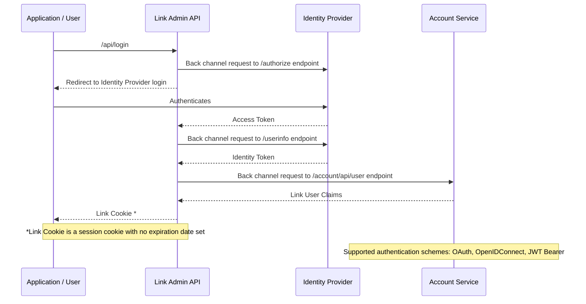

The Link system implements Role-Based Access Control (RBAC) through a claims-based authorization model. Currently, the system has a single "Admin" role configured which has access to all available permissions.

# Inter-service Authentication

Inter-service authentication is enforced using symmetric signing key on a token that is generated by the BFF and passed in requests to each of the micro-services.

Each service is provided access to the same signing key via the Secret Manager to sign tokens that are generated by each service.

There are two implementations of the Secret Manager:

* Azure Key Vault: Uses a centralized/cloud-based key vault to store the symmetric signing key.
* Local Secret Manager: Uses a per-service configuration to define the symmetric signing key used by each service.

The BFF has an option to `LinkTokenService:EnableTokenGenerationEndpoint` which allows users that are authenticated in the BFF to generate a token that can be passed directly to the micro services (for debugging purposes, for example). However, this should not (generally) be enabled in a production environment. In a production environment the BFF should be the only exposed service and the BFF would be responsible for proxying requests to each of the micro services.

When proxying a request from the BFF to micro services that were initiated by a user, the Yarp Proxy automatically generates a token to be passed in that proxy'd request to the micro service. You can control the life-span of the micro-service tokens generated by the BFF using the `LinkTokenService:TokenLifespan` property. The `LinkTokenService:LogToken` property creates log entries when these tokens are generated by the BFF for debugging purposes.

# Claims/Permissions

The following claims define what actions users can perform in the system:

| Claim                       | Description                                          |
|-----------------------------|------------------------------------------------------|
| CanViewLogs                 | Allows viewing system audit and activity logs        |
| CanViewNotifications        | Allows viewing system notifications and alerts       |
| CanViewTenantConfigurations | Allows viewing tenant configuration settings         |
| CanEditTenantConfigurations | Allows modifying tenant configuration settings       |
| CanAdministerAllTenants     | Grants full administrative access across all tenants |
| CanViewResources            | Allows viewing system resources                      |
| CanViewReports              | Allows viewing generated reports                     |
| CanGenerateReports          | Allows generating new reports                        |
| CanGenerateEvents           | Allows generating system events                      |
| CanViewAccounts             | Allows viewing user accounts                         |
| CanAdministerAccounts       | Allows creating/modifying/deleting user accounts     |
| IsLinkAdmin                 | Designates the user as a system administrator        |

# Roles

Currently, only a single role is configured in the system:

**Admin Role**

- Has access to all claims/permissions listed above
- Full system administrative capabilities
- No tenant-level restrictions

# Implementation

The RBAC system is implemented through:

- Claims defined in `LinkSystemPermissions` enum
- Authorization policies that map to individual claims
- Role and user entities that maintain claim assignments
- Claims-based authorization checks in the application

# Future Considerations

## Expanded Claims

The system is designed to support additional claims, particularly:
- UI-specific permissions for granular interface control
- Additional operational permissions as new features are added
- Workflow-specific permissions

## Additional Roles

Plans for expanding role definitions include:

- Creating non-administrative roles with limited permissions
- Role hierarchies
- Custom role definitions per tenant

## Tenant Restrictions

Future updates will include:

- Tenant-specific role definitions
- User-to-tenant mapping
- Tenant-scoped permissions
- Multi-tenant authorization policies