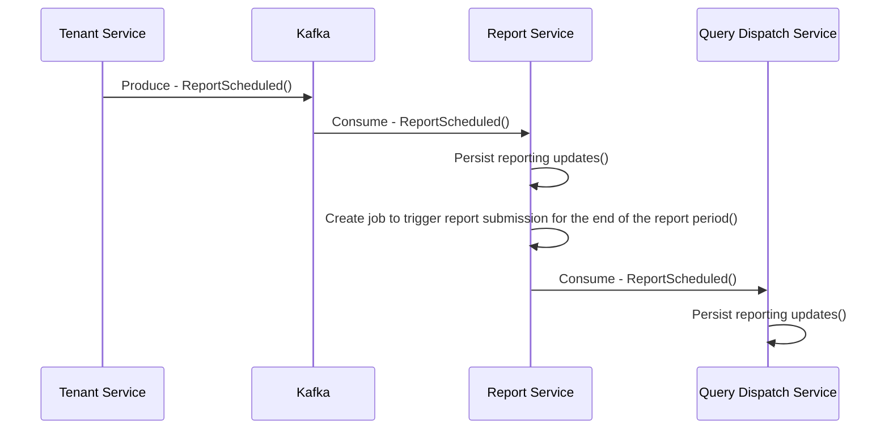
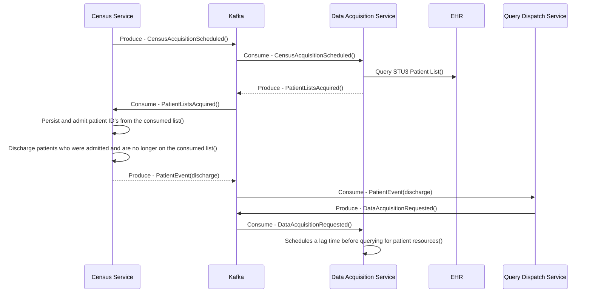
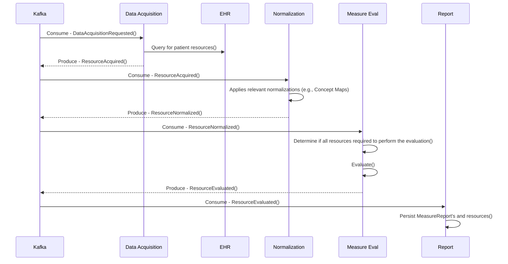

# Deployment Validation

1. Confirm that the following Link Cloud service containers are running:
   - link-account
   - link-audit
   - link-bff
   - link-census
   - link-dataacquisition
   - link-measureeval
   - link-normalization
   - link-notification
   - link-querydispatch
   - link-report
   - link-submission
   - link-tenant
   - link-validation
2. Confirm that the following Link Cloud dependent containers are running:
   - **Databases/Cache**
      - sql-server
      - mongo
      - redis
   - **Telemetry/Observability**
      - otel-collector
      - grafana
      - loki
      - promeutheus
      - tempo
   - **Kafka**
      - kafka-broker
      - kafka-rest-proxy
      - kafka-ui
3. Two 'init' containers are creating SQL database tables and Kafka topics. After the following containers run their process, they will automatically stop.
   - kafka-init
   - sql-init
4. Open a web browser and access Kafka UI. By default, the page can be accessed at `http://localhost:9095`. Click the `Topics` tab and ensure that Kafka topics exist (see example screenshot below). If there aren't any topics populated (shown in the image above), attempt to rerun the following command: `docker compose up kafka_init -d`
5. Open SQL Server Management Studio and connect. The default server name should be `127.0.0.1,1433`. The `SA` password can be found in the `.env` file (The `LINK_DB_PASS` variable) in the Link Cloud repository. Ensure that the following databases were created:
   - link-account
   - link-audit
   - link-census
   - link-dataacquisition
   - link-normalization
   - link-notification
   - link-querydispatch
   - link-tenant
   - link-validation


<Admonition type="info">
  If the databases listed above don't exist, you may attempt to rerun the following command: `docker compose up mssql_init -d`
</Admonition>

# Basic Testing

Configuration database scripts are provided to generate a tenant named `Test-Hospital`. These scripts will load most of the service configurations needed to run Link Cloud. To be capable of performing resource acquisition, a FHIR endpoint will need to be manually added (detailed below). Here are the steps to run the scripts:

1. Open SQL Server Management Studio and connect to your SQL Server Docker container (Defaulted to port 1433).

2. Open and run `\link-cloud\Scripts\load-sql-data.sql`.

3. To properly query for FHIR resources, update the FHIR endpoints in the SQL `link-dataacquisition` database:

```   
UPDATE fhirQueryConfiguration
set FhirServerBaseUrl = '** INSERT FHIR BASE URL HERE **'

UPDATE fhirListConfiguration
set FhirBaseServerUrl = '** INSERT FHIR BASE URL HERE **'
```

4. Open Mongosh in a separate terminal and run the following: `load("\\link-cloud\\Scripts\\load-mongo-data.js")`.

# Manual Reporting

Automated report scheduling can be configured through the Tenant API. However, a manual approach can be done to immediately generate a report. Open Kafka UI and produce the following into the `ReportScheduled` topic:

**Key:**
```
{
  "FacilityId": "Test-Hospital",
  "ReportType": "NHSNdQMAcuteCareHospitalInitialPopulation"
}
```

**Value:**
```
{
  "Parameters": [
  {
    "Key": "StartDate",
    "Value": "2024-09-01T00:00:00"
  },
  {
    "Key": "EndDate",
    "Value": "2024-09-30T23:59:59"
  }]
}
```

Because the report generation process runs immediately after the set `EndDate`, allocate enough time (a few minutes) to perform the subsequent steps.

To manually admit patients, produce the following into the `PatientListsAcquired` topic in Kafka UI:
> [!NOTE]
> The patients included in the event below are examples only. Add patient identifiers that exist in your EHR endpoint.

**Key:**
```
Test-Hospital
```

**Value:**
```
{
	"ReportTrackingId": null,
	"PatientLists": [
		{
			"ListType": "Discharge",
			"TimeFrame": "Between24To48Hours",
			"PatientIds": []
		},
		{
			"ListType": "Admit",
			"TimeFrame": "LessThan24Hours",
			"PatientIds": [
				"hJOGSZyFOTIiwEBWUU6p9NKxflMTOLCRRpLbAkfPrfqee",
				"0VmZaB90pc5yRSefoK6sW9C9WVOvPARAgquBFNtGr6LXk"
			]
		},
		{
			"ListType": "Discharge",
			"TimeFrame": "MoreThan48Hours",
			"PatientIds": []
		},
		{
			"ListType": "Admit",
			"TimeFrame": "Between24To48Hours",
			"PatientIds": [
				"9mDh8TdqYuZP4JZkjbyDkw1SRwOG6TOhCY8GfClh5QG2m"
			]
		},
		{
			"ListType": "Admit",
			"TimeFrame": "MoreThan48Hours",
			"PatientIds": [
			]
		},
		{
			"ListType": "Discharge",
			"TimeFrame": "LessThan24Hours",
			"PatientIds": [
			]
		}
	]
}
```

To discharge a patient and begin their reporting workflow, produce the same `PatientListsAcquired` event without the discharged patient in the list. The example below will discharge `Patient/0VmZaB90pc5yRSefoK6sW9C9WVOvPARAgquBFNtGr6LXk`:

**Key:**
```
Test-Hospital
```

**Value:**
```
{
	"ReportTrackingId": null,
	"PatientLists": [
		{
			"ListType": "Discharge",
			"TimeFrame": "Between24To48Hours",
			"PatientIds": []
		},
		{
			"ListType": "Admit",
			"TimeFrame": "LessThan24Hours",
			"PatientIds": [
				"hJOGSZyFOTIiwEBWUU6p9NKxflMTOLCRRpLbAkfPrfqee"
			]
		},
		{
			"ListType": "Discharge",
			"TimeFrame": "MoreThan48Hours",
			"PatientIds": []
		},
		{
			"ListType": "Admit",
			"TimeFrame": "Between24To48Hours",
			"PatientIds": [
				"9mDh8TdqYuZP4JZkjbyDkw1SRwOG6TOhCY8GfClh5QG2m"
			]
		},
		{
			"ListType": "Admit",
			"TimeFrame": "MoreThan48Hours",
			"PatientIds": [
			]
		},
		{
			"ListType": "Discharge",
			"TimeFrame": "LessThan24Hours",
			"PatientIds": [
				"0VmZaB90pc5yRSefoK6sW9C9WVOvPARAgquBFNtGr6LXk"
			]
		}
	]
}
```

At the end of the reporting period, the Report service will make additional requests to query and evaluate patients that are currently admitted in the facility prior to submitting. After each of those admitted patients are evaluated, the Report service will then produce a `SubmitReport` event to inform the Submission service that a report is complete. To access the submission package open Docker Desktop and click the `link-submission` container. Select the `files` tab and navigate to the `app\submissions` folder. There, you'll be able to download the submission results for the reporting period:


# Reporting Event Workflow

> Note: As Link Cloud continues to develop, the workflow detailed below to generate reports may be subject to large changes.

Detailed below are the steps Link Cloud takes to generate a report for a tenant reporting period. They are broken into phases. Each phase has a sequence diagram to visualize the workflow.

## Report Scheduling



At the beginning of a new reporting period, the Tenant service produces a `ReportScheduled` event. The Query Dispatch and Report services consume and persist the reporting information in the event into their databases. The Report service sets an internal cron job (based on the EndDate of the consumed event) to execute the work needed to complete the report.

## Census Acquisition and Discharge



During the reporting period, the Census service is configured to continually request a new list of patients admitted in a facility by producing the `CensusAcquisitionScheduled` event. The Data Acquisition service consumed this event and queries the facility's List endpoint. After receiving a response back from the EHR endpoints, the Data Acquisition service then produces a `PatientListsAcquired` event that contains a list of all patients that are currently admitted in the facility.

The Census service consumes the `PatientListsAcquired` event and applies updates in the database for patients have been admitted or discharged.

> Note: The Census service treats any patient in the PatientListsAcquired list as an admitted patient. If the Census service has a patient marked as admitted in the database, but the patient is no longer present on the consumed list, it treats the patient as a discharge.

A `PatientEvent` Kafka message is produced for each patient that has been discharged.

The QueryDispatch service consumes the patient events and appends the tenants' reporting information (the info consumed in the `ReportScheduled` event). The service then sets a cron job based on the configured lag time that the facility wants to apply for each discharge. When that lag time is met, the Query Dispatch service produces a `DataAcquisitionRequested` event to trigger the acquisition and evaluation steps.

## Resource Acquisition and Evaluation



A `DataAcquisitionRequested` event is generated for patients that have either been discharged or are still admitted when the reporting period end date is met. This event is the trigger that causes the resource acquisition, normalization and evaluation phases for a patient.

When the Data Acquisition service consumes the `DataAcquisitionRequested` event, the service will use the persisted query plan to make requests to the EHR endpoint for patient FHIR resources that correspond with the report type that is in the value of the consumed event. A `ResourceAcquired` event is produced for each resource that the EHR endpoint responds with.

The Normalization service consumes the `ResourceAcquired` event and applies any normalization configurations that the facility is configured for (Example: Concept Maps). After a resource has been normalized, the service produces a `ResourceNormalized` event.

The Measure Eval service consumes the `ResourceNormalized` events and persists each resource into its database. When the service has accounted for every normalized resource for a patient, it will then perform work to bundle and evaluate those resources against the CQF libraries for the report type in the event. The generated MeasureReport and its evaluated resources are then produced as separate `ResourceEvaluated` events

<Admonition type="info">
  Due to the potential large size of a MeasureReport, the MeasureEval service will produce a single ResourceEvaluated event for the MeasureReport that contains only resource references. Then, the MeasureEval service will produce ResourceEvaluated events for each evaluated resource in the MeasureReport. There is information within the event that allows for the consuming Report service to associate evaluated resources to their corresponding MeasureReport.
</Admonition>

<Admonition type="info">
  The MeasureEval service is capable of producing DataAcquisitionRequested events if the reporting measure also includes the need for additional supplemental data for a patient that meets the initial population criteria of a measure. If this is the case, the MeasureEval service will only produce ResourceEvaluated events after it has evaluated a patient that had had their supplemental resources acquired and normalized.
</Admonition>

When the end of the reporting period is met, the Report service will confirm that it has MeasureReport's for all discharged patients that were within the reporting period. Additionally, it will request that currently admitted patients be evaluated for that reporting period. The service does this by producing `DataAcquisitionRequested` events for each admitted patient which triggers the acquisition/evaluation workflow mentioned above. After those patient MeasureReports are accounted for, the Report service will produce a `SubmitReport` for the Submission service.

# Automated Smoke Testing

An automated smoke test can be found in the `/Tests/E2ETests` folder/project which performs the following actions:

1. Loads a FHIR server with pre-defined synthetic test data
2. Loads a measure definition's evaluation artifacts in the measure eval service
3. Loads the measure definition's validation artifacts in the validation service
4. Creates a basic tenant configuration
5. Initiates the generation of an adhoc report
6. Monitors/waits for the report to complete generating
7. Downloads the report and associated data
8. Perform assertions/validation of the resulting submitted data