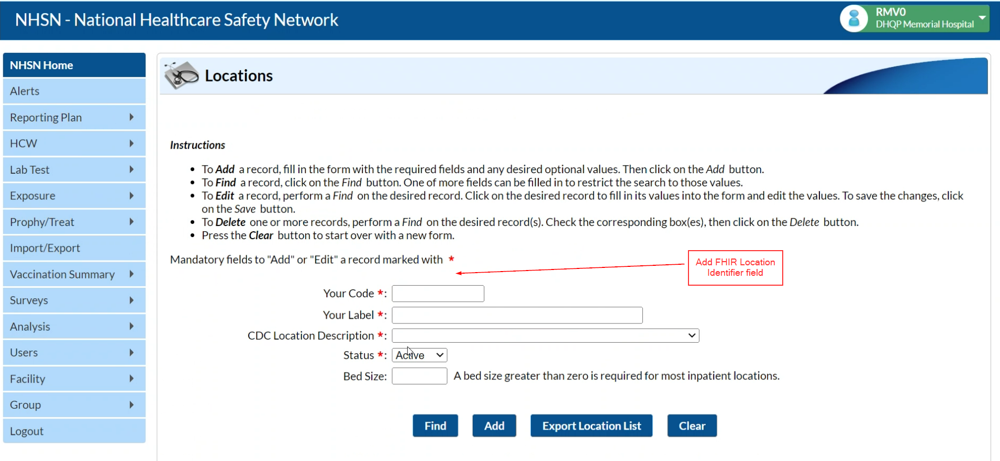
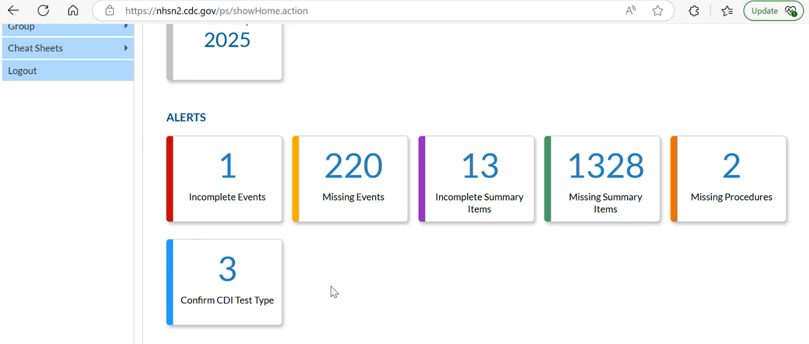
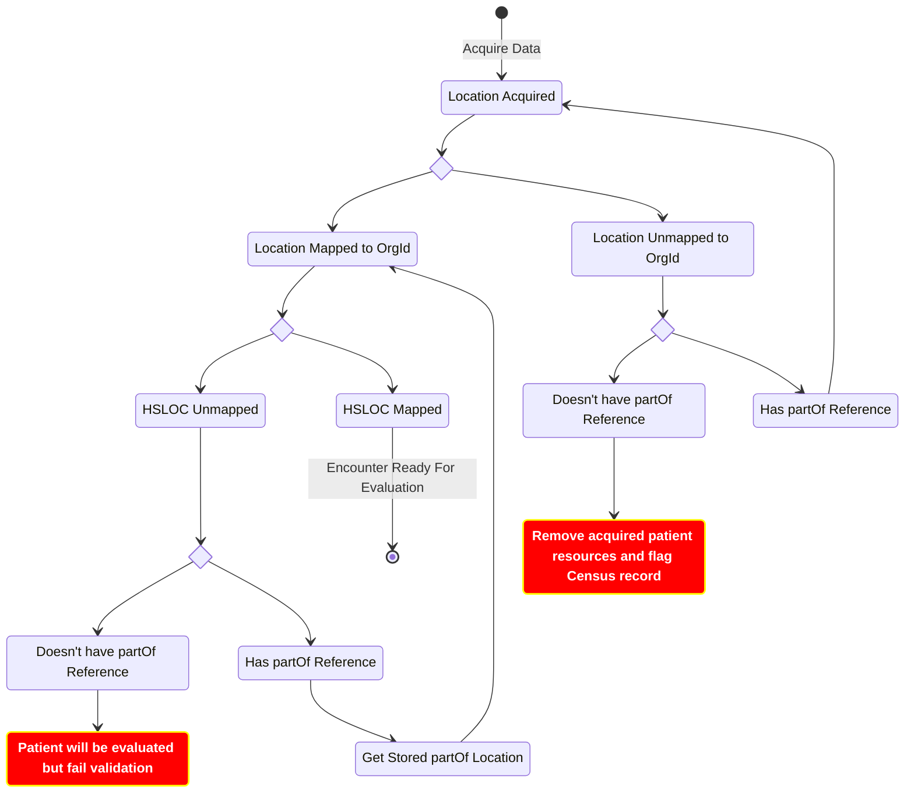
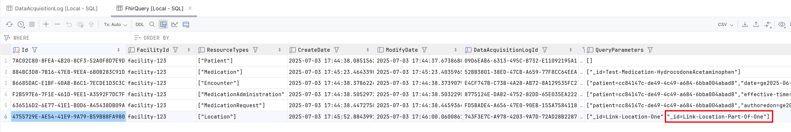
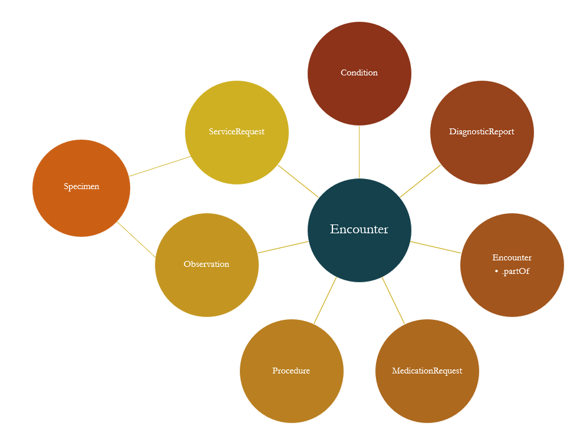

# Background

The NHSN provides a location mapping page that allows infection preventionists to align patient care areas within their facilities to CDC-defined location codes. The NHSN categorizes healthcare locations so that it can draw comparisons across organizations. These mappings are required for reporting surveillance data collected from those locations ([Link to Document](https://www.cdc.gov/nhsn/pdfs/pscmanual/15locationsdescriptions_current.pdf)). As part of NHSN’s requirements, acquired Location resources must contain HSLOC code mappings when applicable. As of 8/28/2025, having a HSLOC mappings present for a patient is **not** required to produce a valid report bundle. However, there may be changes in the future where an HSLOC code must be included in the initial population definition for measure evaluations. To support this, Link must be able to access, maintain, and map queried Location resources to their corresponding HSLOC codes.

In addition, many reporting facilities share a common FHIR data source with other facilities in their hospital network. Because EHR vendors impose certain query limitations, there is a risk that Link may retrieve resources not belonging to the reporting facility. To address this, NHSN requires that each submission bundle contain only data associated with the reporting NHSN OrgId facility.

# Links

- Initial findings for HSLOC mapping changes: [Link Here](https://lantana.atlassian.net/wiki/spaces/LSD/pages/1322483718)
- HSLOC Page: [Link Here](https://www.cdc.gov/nhsn/cdaportal/terminology/codesystem/hsloc.html)
- CDC HSLOC PDF: [Link Here](https://www.cdc.gov/nhsn/pdfs/pscmanual/15locationsdescriptions_current.pdf)
- HSLOC Value Set: [Link Here](https://cts.nlm.nih.gov/fhir/res/ValueSet/2.16.840.1.113762.1.4.1046.265)
- Collab Data Mapping to NHSN OrgId: [Link Here](https://lantana.atlassian.net/wiki/spaces/LSD/pages/1041661955/CoLab+Data+Mapping+to+NHSN+Org+ID)

# How to Match a Reporting Organization to a Location Resource

## Epic

Below is an example of the Epic location hierarchy. It's been identified that the EAF/Hospital Location node represents the reporting facility. The Location.identifier element of that node has been found as a reliable source for Link to identify whether the Encounter location belongs to the proper organization for facilities that use Epic. To do this, Link will need to be capable of traversing up from the Encounter location to its parent EAF Location. 
  

As detailed in the 'CoLab Data Mapping to NHSN Org ID' document, the following sites have had consistent Location.identifier values that represent the reporting organization:

| Collab             | Code       | System                                              |
| ------------------ | ---------- | --------------------------------------------------- |
| Nebraska           | 10         | urn:oid:1.2.840.114350.1.13.**310**.2.7.2.696570    |
| Yale               | 10         | urn:oid:1.2.840.114350.1.13.**301**.2.7.2.696570    |
| URMC               | 101        | urn:oid:1.2.840.114350.1.13.**247**.2.7.2.696570    |
| UC Davis           | 100        | urn:oid:1.2.840.114350.1.13.**93**.2.7.2.696570     |
| Michigan           | 10         | urn:oid:1.2.840.114350.1.13.**277**.2.7.2.696570    |

## Cerner

When pulling inpatient Encounter Location resources from Billings, the location associated with the encounter represented a bed number the patient was in. The `partof` hierarchy went up to room, wing and eventually the Billings Hospital location. Below are some findings:

The following parent Facility Locations were found:
    - Beartooth Billings Clinic
    - Stillwater Billings Clinic
    - Billings Clinic Downtown
    - Billings Clinic Hospital (the reporting org for Link)

Each parent Location has the same `Location.type` and `Location.physicalType`. While the coding system is the same across both parent and child locations, the code looks to be unique. Each of the 4 listed parent facilities has a code of '783' with a display of 'Facility(s)':

~~~
"type": [
    {
        "coding": [
            {
                "system": "https://fhir.cerner.com/**omitted_route**/codeset/222",
                "code": "783",
                "display": "Facility(s)",
                "userSelected": true
            }
        ],
        "text": "Facility(s)"    
    }
]
~~~

If it's determined that `Location.id` is not how we want to target reporting organizations for Cerner, we could use a combination of this code and the name or alias of the resource which is the facility name.

Additionally, each child location that was searched had a matching `Location.managingOrganization` to its parent facility. Even if the Location represented a bed within a room, it had a matching organization that mapped one of the four Parent facilities. In recent calls (as of 8/15/2025), there were mentions that `Location.managingOrganization` can be unreliable, but from the small testing done, it seems like it could be used for Billings (and maybe Cerner). We would need staging data from another Cerner site to see if these findings hold true across facilities.

Cerner Millennium supports querying for locations based on the physical type [Link Here](https://docs.oracle.com/en/industries/health/millennium-platform-apis/mfrap/op-location-get.html). With the following query, we're able to get back all Locations in a Bundle that have been tagged as 'Site' which seem to correlate with Billings facilities: `<FHIR url>/Location?-physicalType=si`. The same query was made against the Baycare collab endpoint. The query response contained the same bundle with facility Location resources tagged as 'Site'. As of 8/19/2025, these Location resources were not validated by Baycare as reporting organization facilities. 

# How to Match HSLOC mappings to a Location Resource

In MVP, the following Location elements are copied to `Location.type` so that Link can apply location based HSLOC Location Concept Maps: 

**Epic:** Normalize `Location.identifier` to `Location.type`

**Cerner:** Normalize `Location.alias` to `Location.type`

# Requirements

## Stakeholder Requirement for Org Id Mapping

| Link | Description | Requirement Type |
| ---- | ----------- | ---------------- |
|[LNK-4057](https://lantana.atlassian.net/browse/LNK-4057) | The reporting organization must exclusively perform measure evaluations for Encounters that have a Location resource mapping to the reporting tenant organization | Stakeholder | 
|[LNK-4058](https://lantana.atlassian.net/browse/LNK-4058) | The reporting organization must submit a patients of interest list for patients that have an Encounter location that maps to the reporting tenant organization | Stakeholder |

### System Requirements

| Link | Description | Requirement Type |
| ---- | ----------- | ---------------- |
|[LNK-4060](https://lantana.atlassian.net/browse/LNK-4060) | Link must have a Rest API configuration endpoint for storing the `Location.identifier.code` value(s) that represent the reporting organization identifier for tenants using Epic | Interface |
|[LNK-4204](https://lantana.atlassian.net/browse/LNK-4204) | Link must have a Rest API configuration endpoint for storing a combination of `Location.type.coding.code` and `Location.alias` that represent the reporting organization identifier for tenants using Cerner | Interface |
|[LNK-4238](https://lantana.atlassian.net/browse/LNK-4238) | Link must have a user interface screen available for users to perform reporting organization tenant configurations | Interface |
|[LNK-4061](https://lantana.atlassian.net/browse/LNK-4061) | Link must be capable of traversing and querying `partOf` Location references so that mapped tenant reporting organizations can be found | Functional |
|[LNK-4210](https://lantana.atlassian.net/browse/LNK-4210) | Link must track acquired Location resource references and their facility mapping status to reduce query requests needed to perform organization resolution | Functional |
|[LNK-4239](https://lantana.atlassian.net/browse/LNK-4239) | Link must have a user interface screen available for users to view acquired Location resource references and their facility mapping status | Interface |
|[LNK-4211](https://lantana.atlassian.net/browse/LNK-4211) | Link must track unmapped Encounter resource references to cross check that other queried resources are not associated with unmapped Encounters | Functional |
|[LNK-4062](https://lantana.atlassian.net/browse/LNK-4062) | Link must only produce `ResourceAcquired` Kafka events for FHIR resources that have been mapped to a reporting organization | Functional | 
|[LNK-4075](https://lantana.atlassian.net/browse/LNK-4075) | Link must generate audit events when a Patient has no Encounter Locations that map to the reporting organization for a tenant | Functional |
|[LNK-4076](https://lantana.atlassian.net/browse/LNK-4076) | Link must generate audit events when an Encounter Location does not map to the reporting organization for a tenant | Functional |
|[LNK-4218](https://lantana.atlassian.net/browse/LNK-4218) | Link must generate a new Kafka event that informs consuming services when a patient does not have an Encounter that maps to the reporting tenant organization | Functional |
|[LNK-4219](https://lantana.atlassian.net/browse/LNK-4219) | Link must flag Report MeasureReportSubmissionEntry records for patients that do not have any Encounter Locations that map to the reporting organization for a tenant | Functional |
|[LNK-4077](https://lantana.atlassian.net/browse/LNK-4077) | Link must flag Census records for patients that do not have any Encounter Locations that map to the reporting organization for a tenant | Functional |
|[LNK-4078](https://lantana.atlassian.net/browse/LNK-4078) | Link must generate an audit event when a patient of interest record is purged due to not having an Encounter Location that maps to the reporting organization for a tenant | Functional |
|[LNK-4216](https://lantana.atlassian.net/browse/LNK-4216) | Link must generate audit events when acquired resources reference an Encounter that doesn't map to the reporting organization for a tenant | Functional |

## Stakeholder Requirement for HSLOC Mapping

[LNK-4041](https://lantana.atlassian.net/browse/LNK-4041): When applicable, patients of a reporting organization must have Encounter Location resources map to NHSN HSLOC codes

### System Requirements

| Link | Description | Requirement Type |
| ---- | ----------- | ---------------- |
| [LNK-4042](https://lantana.atlassian.net/browse/LNK-4042) | Link must be capable of querying `Location.partOf` references so that potential parent HSLOC mapped Locations can be included when evaluating an Encounter | Functional |
| [LNK-4209](https://lantana.atlassian.net/browse/LNK-4209) | Link must have an API endpoint to manually configure HSLOC mappings for a reporting facility | Interface |
| [LNK-4047](https://lantana.atlassian.net/browse/LNK-4047) | Link must be capable of appending mapped HSLOC codes to acquired `Location.type` resources | Functional | 
| [LNK-4043](https://lantana.atlassian.net/browse/LNK-4043) | Link must be capable of including the `Location.partOf` hierarchy when performing measure evaluations | Functional | 
| [LNK-4079](https://lantana.atlassian.net/browse/LNK-4079) | Prior to evaluating, Link must generate an audit event when an Encounter does not have any HSLOC mapped locations  | Functional | 

## Stakeholder Requirements for NHSN App Integration

| Link | Description | Requirement Type |
| ---- | ----------- | ---------------- |
| [LNK-4212](https://lantana.atlassian.net/browse/LNK-4212) | Link must be capable of retrieving mapped codes from an external NHSN Location API that represents the reporting organization | Functional | 

### System Requirements 

| Link | Description | Requirement Type |
| ---- | ----------- | ---------------- |
| [LNK-4045](https://lantana.atlassian.net/browse/LNK-4045) | To reduce external request activity, Link must maintain an internal state for queried HSLOC mappings | Functional | 
| [LNK-4044](https://lantana.atlassian.net/browse/LNK-4044) | Link must be capable of retrieving HSLOC mapped codes from an external NHSN Location API | Functional | 
| [LNK-4046](https://lantana.atlassian.net/browse/LNK-4046) | Link must have an API endpoint available to manually update HSLOC mappings for a given facility | Interface | 
| [LNK-4048](https://lantana.atlassian.net/browse/LNK-4048) | Link must be capable of posting un-mapped location alerts to an external NHSN API | Functional | 
| [LNK-4063](https://lantana.atlassian.net/browse/LNK-4063) | Link admin users must be capable of manually updating the HSLOC mappings from a UI | Interface |

# External Request: NHSN Location API 

As of 8/21/2025, the Link team continues to gather requirements for Leidos on HSLOC and Org Id mappings that need to be maintained through the NHSN app. Below are some initial ideas on what Link would need from an NHSN hosted API to access those mappings:

**GET Operation**
- GET all locations for a given NHSN Org Id
- GET single location - Param: NHSN Org Id, Location identifier
- Responses should contain all values from the Location page.

**POST Operation**
A post operation to alert when a location was found that does not have a mapping notification back to NHSNLink

When a location mapping is inserted or modified, the external NHSN app POSTs the update to Link (Normalization API detailed below).

# BotW Change Proposal

## State Diagram

## Data Acquisition Changes

Reporting facilities often share the same FHIR data source with other facilities within their hospital network. Due to the FHIR query limitations provided by EHR vendors, there is a risk that Link queries for resources that don't belong to the reporting facility. Because of this, Link must maintain Location resource information that can reliably check to see if queried Encounters map to a reporting facility. The `How to Match a Reporting Organization to a Location Resource` section above shows findings on which Location elements can represent facilities for Cerner and Epic vendors. The Data Acquisition will need to have the following functionality:

### Query partOf Locations

Currently, Data Acquisition can maintain and query resource references that are found on acquired resources. For example, if an Encounter contains a Location resource reference, the reference will be queried if configured to do so. Additionally, if that referenced Location contains a partOf reference to another Location, the `partOf` Location is added to the acquisition logging workflow and also queried. However, as of 7/7/2025, the acquisition log for the partOf Location was not produced as a ResourceAcquired event. A story will need to be created if this has not been resolved.

### Org ID Checking

**API for Configuration:** A REST API endpoint will need to be available for sites to configure Location resource element values that represent their reporting organization. The `How to Match a Reporting Organization to a Location Resource` section details how those elements differ between vendors. This implementation must be fluid as we continue to investigate the reliability of the information in the above-mentioned section. The Data Acquisition service must store this information when a POST/PUT request is made by the user.

**Location Tree Table:** Create a table to track previously queried Location resource IDs and whether they eventually mapped to one of the configured organization Location resources. Suggested columns:
    - Facility Id
    - Location Id
    - Location Name
    - Location Alias
    - A status flag on whether the location resource maps to a facility's organization
    - Date that the Location resource was last queried
    - PartOf column that contains the table ID of the parent location tree record 

**Unmapped Encounter Table:** To ensure that Link does not process initial or supplemental resources that reference an Encounter that doesn't belong to the reporting facility, Data Acquisition must persist these Encounter IDs. While querying for resources, Data Acquisition must cross-check that acquired resources don't reference an Encounter in this table. Below is a diagram to show the relationship other FHIR resources relevant to NHSN reporting have to an Encounter:

**During Initial Query Phase:** When an Encounter is queried, the Data Acquisition service must check the new location tree table to see if there is a mapping for the location referenced in the encounter. NOTE: This is intended to replace the current Location searching called in the Query Plan. Location in the Query Plans can be removed.
    - If there is a mapped Location and it matches to an org id: Continue the standard acquisition process
    - If there is a mapped Location and it does not map to an org id:
        - Don't continue querying
        - Produce Audit event that the Encounter Id belonged to an outside OrgId
        - Do not produce `ResourceAcquired` event for the Encounter Id
    - If there is no mapping for the Location:
        - Create an acquisition log to query for the location. The QueryType of the log should be distinct from the current Search/Read types.        
        - The worker of the new Data Acquisition log type should:
            1. Query for the Location resource
            2. Add the queried location reference to the new Location mapping table and check to see if the Location.identifier matches the reporting the organization identifier of the facility. Update the record to indicate whether the location is part/not part of the reporting org Id.
            3. If the Location contains a `partOf` reference, repeat step 1.
            4. If no queried Location.identifier matches one of the org id's for the facility, don't produce an acquired event for the related Encounter and its Locations
    - If ALL Encounters have Location resources that don't map to a reporting Org Id, create an Audit event and produce an event to a new topic so that Census and Report can be informed of the patient. 
    - A lock on producing `ResourceAcquired` events should be placed on each patient until Link verifies that there is an Encounter that maps to the reporting `Location.type` org Id.

### API Interface

The proposed Data Acquisition API Interface updates can be found in the <Link href="../../services/DataAcquisitionService">Data Acquisition Service Open API</Link> page. The following additions have been made to the spec:

| Request Type | Route                          | API Link                                                                                                                                                |  
| ------------ | ---------------------------    | ------------------------------------------------------------------------------------------------------------------------------------------------------- |
| GET          | /location-org-configs          | <Link href="../../services/DataAcquisitionService/0.2.0/spec/openapi#tag/location-org-configs/GET/location-org-configs">Link Here</Link>                 |
| POST         | /location-org-configs          | <Link href="../../services/DataAcquisitionService/0.2.0/spec/openapi#tag/location-org-configs/POST/location-org-configs">Link Here</Link>                |
| PUT          | /location-org-configs          | <Link href="../../services/DataAcquisitionService/0.2.0/spec/openapi#tag/location-org-configs/PUT/location-org-configs">Link Here</Link>                 |
| DELETE       | /location-org-configs          | <Link href="../../services/DataAcquisitionService/0.2.0/spec/openapi#tag/location-org-configs/DELETE/location-org-configs">Link Here</Link>              |
| GET          | /location-mappings             | <Link href="../../services/DataAcquisitionService/0.2.0/spec/openapi#tag/location-mappings/GET/location-mappings">Link Here</Link>                       |
| POST         | /location-mappings             | <Link href="../../services/DataAcquisitionService/0.2.0/spec/openapi#tag/location-mappings/POST/location-mappings">Link Here</Link>                      |
| PUT          | /location-mappings             | <Link href="../../services/DataAcquisitionService/0.2.0/spec/openapi#tag/location-mappings/PUT/location-mappings">Link Here</Link>                       |
| DELETE       | /location-mappings             | <Link href="../../services/DataAcquisitionService/0.2.0/spec/openapi#tag/location-mappings/DELETE/location-mappings">Link Here</Link>                    |
| GET          | /location-mappings/hierarchies | <Link href="../../services/DataAcquisitionService/0.2.0/spec/openapi#tag/location-mapping-hierarchies/GET/location-mappings/hierarchies">Link Here</Link> |

## Census Changes

**Org Id Resolution**: If Data Acquisition determines that a patient does not have any Encounters that map to the reporting organization, an event should be published so that the Census service can flag the patient as one to not include in the patients of interest list. Any REST API's that return a patients of interest list for a reporting period should omit these patients from the results.

## Report Changes 

**Org Id Resolution**: If Data Acquisition determines that a patient does not have any Encounters that map to the reporting organization, the previously mentioned event for Census should also be consumed by the Report service. When consumed, the Report service should flag the patient as one to not include in a facility's report.

## Normalization Changes

**Normalization Operation Update:** An update to our Code Map operation or a new operation specifically targeting conversions from a Location source element to the `Location.type` target will need to be made. This will also require an update to the Normalization API to accept the new configuration requests. The new or updated operation will need to support how we are currently identifying local codes for Epic and Cerner detailed in the `How to Match an HSLOC mappings to a Location Resource`

### NHSN App Integration

As of 8/20/2025, it's planned for the NHSN App to be the source of truth for mapping local location codes to HSLOC codes (Detailed in the `External Request: NHSN Location API`). Until then, the work done in `Normalization Operation Update` will be how facilities map their local codes to HSLOC codes. Below are some initial ideas on changes the Normalization service will need to integrate with the NHSN external app. This work should **not** be done until we have finalized a direction with Leidos:    

**Location Mapping Table**: A new table will need to be created that represents a facility's HSLOC mappings from the external NHSN App. The table will need to include the following information:

- Facility Id
- FHIR Location local code:
    - Cerner: `Location.alias`
    - Epic: `Location.identifier` 
- The HSLOC code
- Ignore (Un-mapped Location that doesn't need a mapping from the NHSN app)

**API Update**: The Normalization service will expose a Rest API endpoint that will allow the external NHSN app to post when a facility location has been updated. Additionally, an endpoint needs to be added to manually trigger the NHSN Location update where Normalization queries the NHSN endpoint and perform the GET request and updates the local mapping table.

**Consumer Workflow**: The Normalization service will be responsible for externally accessing and maintaining HSLOC mappings for each reporting facility. As Location resources are consumed, the Normalization service will internally persist these mappings to the new mapping table to reduce the number of external requests made to the NHSN API.

## Measure Eval Changes

**Consumer Workflow**: The Measure Eval consumes Location resources for a corresponding CorrelationId. After the Data Acquisition updates mentioned above have been applied, this will also include any `partOf` Location resources associated with the patient Encounter. Since these acquired `partOf` locations will also be tagged with the patient CorrelationId, they will be included as part of the bundle for evaluation. At this stage, Location resources that are mapped to an HSLOC code have been applied.

### Future Considerations

**Note:** No future actions are needed on these considerations. 

Link currently processes all patient and shared resources indiscriminately during measure evaluation. However, encounters may not meet the initial population because of missing/invalid HSLOC mappings. Due to a freeze on large CQL changes to the NHSN measures, a validation invariant ([Link Here](https://build.fhir.org/conformance-rules.html#constraints)) has been added to throw an error when a patient does not have an HSLOC location in their report bundle. This is potentially wasteful since patients up to this point will have their initial and supplemental resources queried and stored only to be tagged as not reportable. Below is a strategy on how to perform HSLOC validations further upstream in the BotW workflow and reduce the amount of storage needed to persist invalid patient reports. As of 8/28/2025, Kristi has changed the validation invariant so that it doesn't throw an error when an HSLOC mapping are not present on a patient bundle. If it ever becomes a requirement to have a mapping present in the bundle, they will consider adding the requirement to the CQL rather than as a validation rule.

**HSLOC Checking**: After consuming the last resource for the initial Encounter evaluation, the Measure Eval service checks to see if there is a qualifying HSLOC location for the corresponding Correlation Id prior to running the evaluation. If there isn't, the Measure Eval service should bypass evaluation and produce a `ResourceEvaluated` event that informs the Report service that the Encounter did not meet the initial criteria. Additionally, the Measure Eval service should produce an event that informs its end users that a patient did not have an associated HSLOC code.

This change benefits in the following ways:
- Data Acquisition will not pull supplemental data for the patient, reducing query strain on NHSNLink and facilities.
- Kafka topics will not have supplemental resource events stored and replicated: `ResourceAcquired`, `ResourceNormalized`, `ResourceEvaluated`.
- Measure Eval will not have supplemental data stored in MongoDB for the patient.
- Report will not have initial and supplemental data stored in MongoDB for the patient.
- Internal Azure Blob Storage will not have an aggregated bundle stored for the patient.
- NHSN and Link users will still know which patients failed the HSLOC validation requirement.

The stakeholder requirement [LNK-4080](https://lantana.atlassian.net/browse/LNK-4080) was created to track the approval to implement this functionality. 
