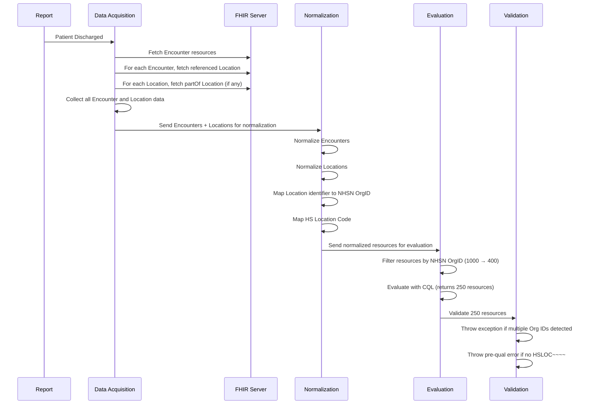

# Background

* Epic: LNK-3168
* Target Release: v0.3.0

Many health systems operate multiple facilities under a **single shared FHIR endpoint**. When NHSNLink queries for a single patient’s data, the returned results may include **Encounters and other resources** from **multiple facilities**, each associated with a **different NHSN OrgID**. However, NHSN requires that **each submission bundle only include data from a single NHSN OrgID**.

The FHIR server does **not support querying data scoped by OrgID**, so we must handle this **post-query** by filtering based on facility information.

---

# Core Problem

- A **single patient query** returns data from **multiple facilities** in the health system.
- Each facility is associated with a **unique NHSN OrgID**.
- The FHIR API does **not support OrgID filtering**, so **post-query filtering** is required.
- A single **tenant** in NHSNLink may represent **multiple NHSN OrgIDs**.
- Therefore, the system must support **splitting one dataset into multiple NHSN-specific bundles** per patient, using **Location-to-OrgID mapping**.

---

# Proposed Solution

## 1. **Post-Query Filtering by NHSN OrgID**

- After fetching resources for a patient, filter all data by the `Location.identifier` field.
- Use a **tenant-level configuration** to map each `Location.identifier` to the appropriate NHSN OrgID.
- Group and process the patient data into **distinct bundles**, one per NHSN OrgID represented in the dataset.

---

## 2. **Mapping Structure**

- Extend normalization logic to follow `Encounter.location.location` → `Location` → `Location.partOf` chain.
- Maintain a mapping of each `Location.identifier` to its corresponding NHSN OrgID.
- This mapping must:
    - Support **multiple OrgIDs per tenant**
    - Be **configurable** per environment/integration

---

## 3. **Normalization Phase Enhancements**

During normalization:

- Enrich `Location` resources with resolved `NHSN OrgID` from the mapping.
- Annotate normalized `Encounter`, `Condition`, etc., with the derived OrgID based on linked `Location`.
- Tag resources with `orgIdTag` to allow downstream services to split/filter accordingly.

---

## 4. **Evaluation and Bundle Construction**

- After normalization, group resources by NHSN OrgID.
- For each OrgID:
    - Evaluate resources relevant to that OrgID.
    - Generate a **separate bundle** containing only data tied to that OrgID.

- Example:  
  1 patient → 1 FHIR query → 1000 resources  
  → Filtered into 2 groups: 600 (OrgID A), 400 (OrgID B)  
  → 2 NHSN bundles submitted

---

# Outstanding Questions

| Topic                | Question                                                                                                  |
|----------------------|-----------------------------------------------------------------------------------------------------------|
| **FHIR IDs**         | Since patient FHIR IDs are shared, how do we ensure data partitioning remains accurate?                   |
| **Location Mapping** | How do we validate and maintain the Location.identifier → NHSN OrgID mapping?                             |
| **CQL Integration**  | Do we need CQL logic to check for OrgID or HS Location Code presence, or is this handled upstream?        |
| **Evaluation Scope** | Should CQL logic explicitly exclude resources not associated with the active OrgID?                       |
| **Bundle Assembly**  | Can the bundling logic efficiently split patient data into multiple parallel NHSN OrgID-specific outputs? |
| **Mapping Source**   | Can we leverage existing CCN → OrgID mappings (e.g., from protect/1CDP project)?                          |

---

# Next Steps

1. Define Epic and associated Jira Stories.
2. Confirm normalization pipeline supports NHSN OrgID tagging per resource.
3. Confirm how Location mapping will be configured and maintained per tenant.
4. Prototype splitting and filtering logic in test environment using URMC or Orlando data.
5. Await NHSN feedback on facility/location service structure and expectations.

---

# Example Use Case

**Tenant: URMC**

- Shared FHIR Endpoint
- Single patient has:
    - 3 encounters at Strong Memorial (OrgID 10756)
    - 2 encounters at Highland Hos

# Sequence

