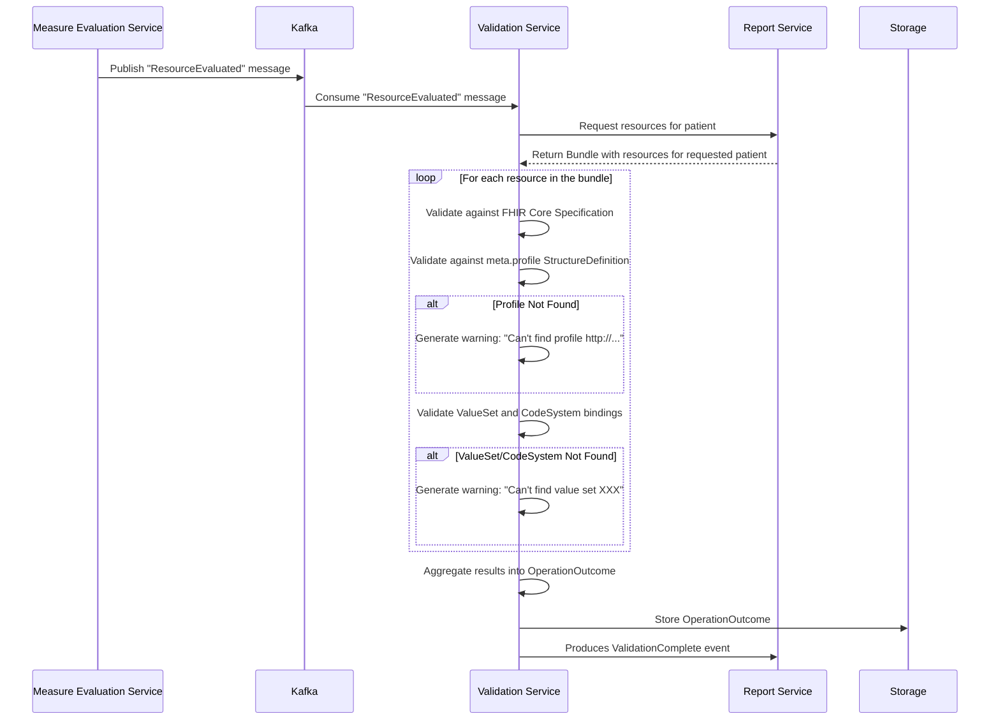

---

id: ValidationService
name: Validation Service
version: 0.2.0

summary: |
  Service that provides functionality for validating clinical data in the system.

owners:
  - arch_team

receives:
  - id: ReadyForValidation
    
sends:
  - id: ValidateCode
  - id: ValidationComplete

specifications:
  openapiPath: openapi.yml

badges:
  - content: "Java"
    backgroundColor: green
    textColor: white
  - content: MSSQL
    backgroundColor: red
    textColor: white
  - content: '8075'
    backgroundColor: gray
    textColor: white

---

## Overview

The Validation service is a Java based application that is responsible for validating FHIR resources against the FHIR specification and any additional constraints defined by the Link Cloud tenant. The service utilizes the [HAPI FHIR library](https://hapifhir.io/) to perform the validation.

- **Image Name**: link-validation
- **Runtime Requirements**
  - CPU: 1/2 - 1 
  - RAM: 1024-3072 MB

## Nodes
  
<NodeGraph />

## Common Configurations

* [Azure App Config](/docs/custom/config/java#azure-app-config)
* [Telemetry](/docs/custom/config/java#telemetry)
* [Swagger](/docs/custom/config/java#swagger)
* [SQL Server](/docs/custom/config/java#sql-server)
* [Kafka](/docs/custom/config/java#kafka)
* [Service Authentication](/docs/custom/config/java#service-authentication)

## Environment Variables

| Env Variable      | Description                                                                       | Type/Value              | Secret? |
|-------------------|-----------------------------------------------------------------------------------|-------------------------|---------|
| JAVA_TOOL_OPTIONS | Specify min/max Java heap size                                                    | `-Xms1024 -Xmx2048`     | No      |

## Custom Configurations

| Property Name     | Description                                                                       | Type/Value              | Secret? |
|-------------------|-----------------------------------------------------------------------------------|-------------------------|---------|
| artifact.init     | Whether or not to initialize the artifacts in the database with default artifacts | true (default) or false | No      |

## Features and Functionality

### New Installation Notes

After a new installation of the validation service, the following should be run/executed:

* `/api/aritfact/$initialize` endpoint should be run to initialize the database with artifacts that are embedded in the validation service.
* `/api/category/$initialize` endpoint should be run to initialize the database with default categories stored in `/src/main/resources/categories.json` (within the code-base)

PENDING: This functionality is going to be altered so that they are automatically initialized on service startup when no artifacts or categories already exist in the service's database.

### Upload & Storage

Artifacts are uploaded either individual or as an NPM package (preferred).

- Individually: `PUT /api/validation/artifact/:type/:name`
- `type` = "RESOURCE"
- `name` = FHIR resource `id`
- As a package: `PUT /api/validation/artifact/:type/:name`
- `type` = "PACKAGE"
- `name` = NPM package id

> Note: The Admin UI currently only supports uploading a FHIR `Bundle` of resources. Doing so implies that the Admin UI can only upload individual resources from that Bundle to the validation service. We may consider using NPM packages in the Admin UI and aligning the MeasureEval service and the Validation service to use just NPM packages.

### Process Flow

<AccordionGroup>
  <Accordion title="1. Measure Evaluation Completion">
    - The Measure Evaluation Service evaluates a patient.
    - Once evaluation is complete, it produces a Kafka `ResourceEvaluated` message for each resource returned by measure evaluation (including the MeasureReport).
  </Accordion>
  <Accordion title="2. Report Services Persists MeasureReport">
    The report service consumes `ResourceEvaluated` and persists the resources.
    * When the `MeasureReport` is processed by the Report service, it uses that to determine when it has received and persisted *all* resources.
    * After all resources are persisted, the status of the patient for the submission changes to `ReadyToValidate`.
    * After the status of the patient's submission changes, it produces a `ReadyForValidation` event.
  </Accordion>
  <Accordion title="3. Validation Service Consumption">
    - The Validation Service consumes the Kafka `ReadyForValidation` event.
    - It retrieves the **MeasureReport** for the specified patient from the Report Service.
    - It extracts all contained FHIR resources and constructs a **Bundle** for validation.
  </Accordion>
  <Accordion title="4. Validation Execution">
    - Each resource in the bundle is validated individually.
    - The validation process includes:
    - **FHIR Core Specification Validation**: Ensures compliance with the base FHIR standard.
    - **Profile Validation**: Each resource is checked against the profiles asserted in `meta.profile`.
    - If a required **StructureDefinition** (profile) is missing, a **warning** is generated:
    *"Can't find profile http://.../us-core-observation"*
    - **ValueSet and CodeSystem Validation**: Ensures that coded elements conform to the expected ValueSets and CodeSystems.
    - If a required **ValueSet** or **CodeSystem** is missing, a **warning** is generated:
    *"Can't find value set XXX"*
    - All validation results are aggregated into a single **OperationOutcome**, capturing any validation issues.
    - The **OperationOutcome** containing all validation issues is stored for further processing or review.
    - The categorization process is initiated against the validation issues found, and each issue is matched (if possible) to a category.
    - Categorized results are persisted in the database.
    - The validation service produces a `ValidationComplete` Kafka event and includes an indication of whether the patient's submission is valid.
  </Accordion>
</AccordionGroup>

### Configuration

The Validation Service supports two types of artifacts that define validation rules:

1. **Package (`package.tgz` format)**
 - A packaged collection of FHIR artifacts (profiles, ValueSets, CodeSystems).

2. **FHIR Resource Artifacts**
 - Individual **StructureDefinitions**, **ValueSets**, and **CodeSystems** can be provided.

In addition to artifacts, categories must be initialized/specified in order to have categorized results. Otherwise, all validation results end up being "uncategorized".

Categories can be configured individually or in bulk.

### Example: Profile Validation

When the validation service encounters an Observation resource like the following:

```json
{
  "resourceType": "Observation",
  "meta": {
    "profile": ["http://.../us-core-observation"]
  },
  "... other properties"
}
```

It will:

* Validate the resource against the core FHIR specification.
* Validate against the http://.../us-core-observation profile.
* If the profile is missing, generate a warning.

Similarly, for properties bound to a ValueSet or CodeSystem, the service expects these artifacts to be provided. If they are missing, it will issue warnings.

### Sequence Diagram

The following diagram illustrates the relationship between the Measure Evaluation Service, Kafka, and the Validation Service:



### Known Deficiencies
- **Global scope**: All stored artifacts are always loaded; there is no filtering or scoping based on tenant or package.
- **No tenant-specific configuration**: There is no ability to configure validation behavior per tenant or per package version.
- Use of the HAPI FHIR validation libraries only supports `CodeSystem`, `ValueSet`, and `StructureDefinition` resources.

## Future Considerations

* Operation to bulk _retrieve_ categories and their rules that can be updated in an text editor and then provided back to the _bulk save_ operation.
* Operation to validate _and_ categorize a resource (or Bundle) and return a composite response of the validation results and associated categories.
* Operation to re-validate and re-categorize a given report, to update the persisted set of results and categories for the report. 