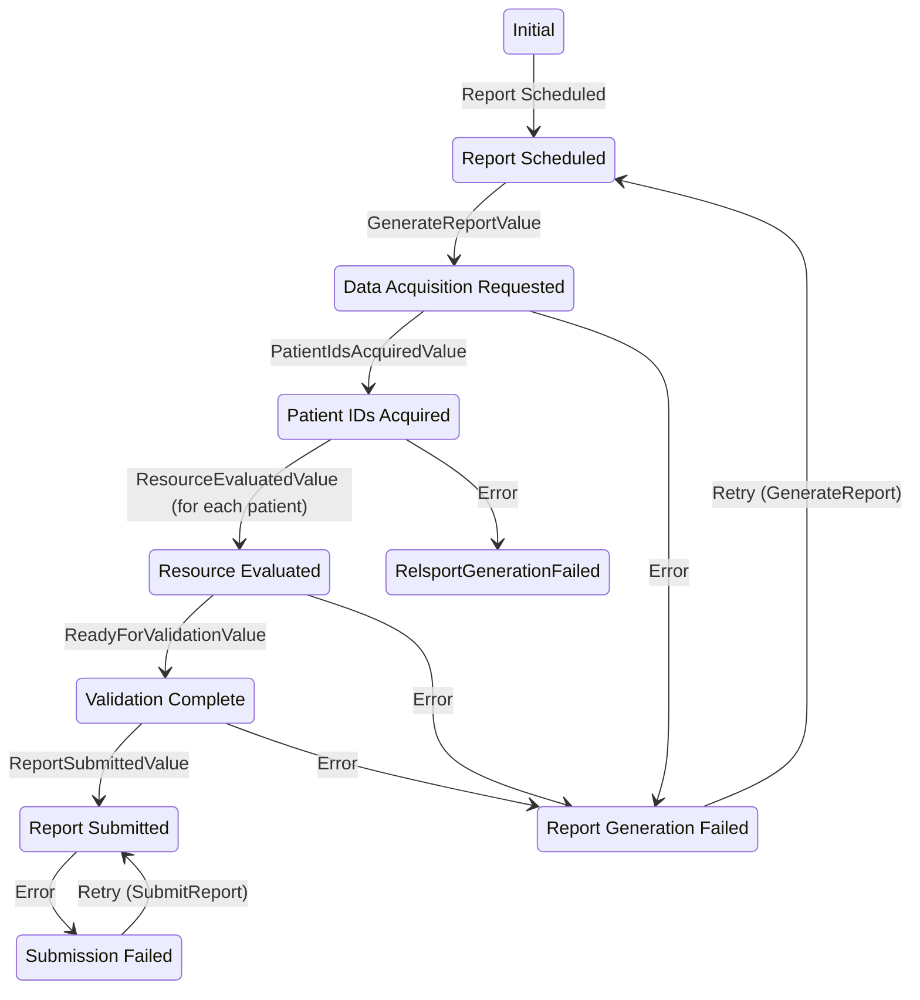

---

id: Report
name: Report
version: 0.2.0

summary: Report related information and function

owners:
  - arch_team

services:
  - id: MeasureEvalService
  - id: NormalizationService
  - id: QueryDispatchService
  - id: ReportService
  - id: SubmissionService

---

## Overview

The Report domain encompasses the full lifecycle of data extraction, transformation, evaluation, and delivery for 
reporting workflows. It orchestrates the flow of raw clinical data into structured, validated, and submitted quality 
reports. Each service plays a specialized role in enabling modularity, traceability, and performance at scale.

## Definitions

| Concept                 | Description                                                                                                                                       |
|-------------------------|---------------------------------------------------------------------------------------------------------------------------------------------------|
| Report                  | The output of Link's evaluation of data. A report can be submitted to NHSN, it can be evaluated in Power BI, it can be visualized in a custom UI. |
| Evaluation              | The process of doing something with data within Link (i.e. acquire, normalize, check criteria, submit).                                           |
| Reporting Requirement   | A description of the need for data in a report. (i.e. "Bed capacity reporting during a pandemic" or "Hypoglycemic patients")                      |                                                                                                                                        |
| Reporting Orchestration | Indicates the steps to take within the Link system to produce reportable data.                                                                    |

## Stakeholder Requirements

* Reporting functionality SHALL be modular so that it can be used for multiple use cases
* Link acquires (either via PUSH or PULL) and evaluates the data in a reporting pipeline.
* Reporting pipelines SHALL be orchestrated via configuration of services
* As a reporting organization and reporting consumer, I want the system to retain version history of IGs used during reporting in a reporting period, so that deleted reports can be accurately regenerated using their original definitions.

## Functional Requirements

TODO

## Diagrams

### State

