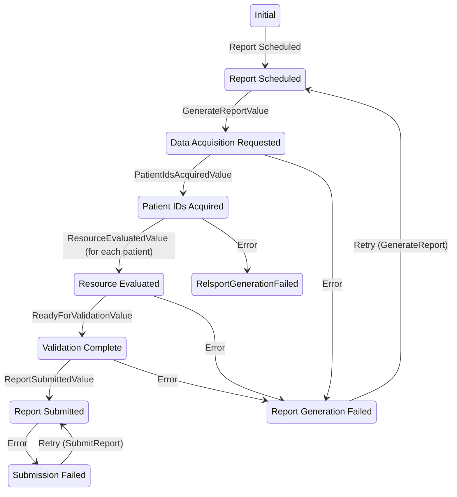

---

id: Report
name: Report
version: 0.2.0

summary: Report related information and function

owners:
  - arch_team

services:
  - id: MeasureEvalService
  - id: NormalizationService
  - id: QueryDispatchService
  - id: ReportService
  - id: SubmissionService

---

## Overview

The Report domain encompasses the full lifecycle of data extraction, transformation, evaluation, and delivery for reporting workflows. It orchestrates the flow of raw clinical data into structured, validated, and submitted quality reports. Each service plays a specialized role in enabling modularity, traceability, and performance at scale.

## Diagrams

### State

