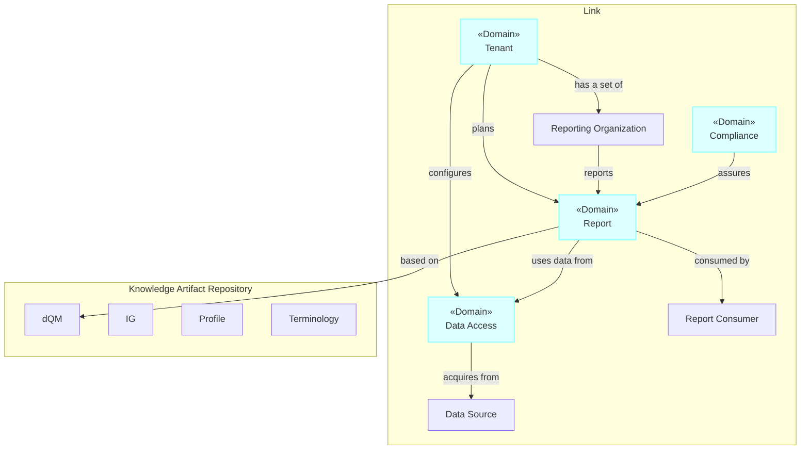

---

id: Tenant
name: Tenant
version: 0.2.0

summary: Tenant related information and function

owners:
  - arch_team

services:
  - id: CensusService
  - id: TenantService

---

# Overview 

Tenant abstracts entities with specific authority and access to Link's behaviors and information. 

Examples:
- A hospital system using Link to report performance of one of its hospitals to a federal agency is a tenant.  
- A report consumer that receives access to an individual report, or even a reporting stream, is a tenant.
- The systems operator with deployment-wide authority to all information and behavior in Link is a tenant.

## Requirements

* As a tenant, I want to configure so that my Link requirements are satisfied
  * As a tenant, I want to configure reporting so that my reporting requirements are satisfied
    * As a tenant, I want to plan reports so that my reporting requirements are satisfied
      * As a tenant, I want to plan reports so that my reporting requirements are satisfied
      * AC: Able to set Cron-based recurrence
      * AC: Able to
  * As a tenant, I want to configure data sources so that my reporting requirements are satisfied
  * As a tenant, I want to configure data transformation so that my reporting requirements are satisfied
  * As a tenant, I want to configure reporting organizations so that my reporting requirements are satisfied

## Diagrams

### Flow Chart

