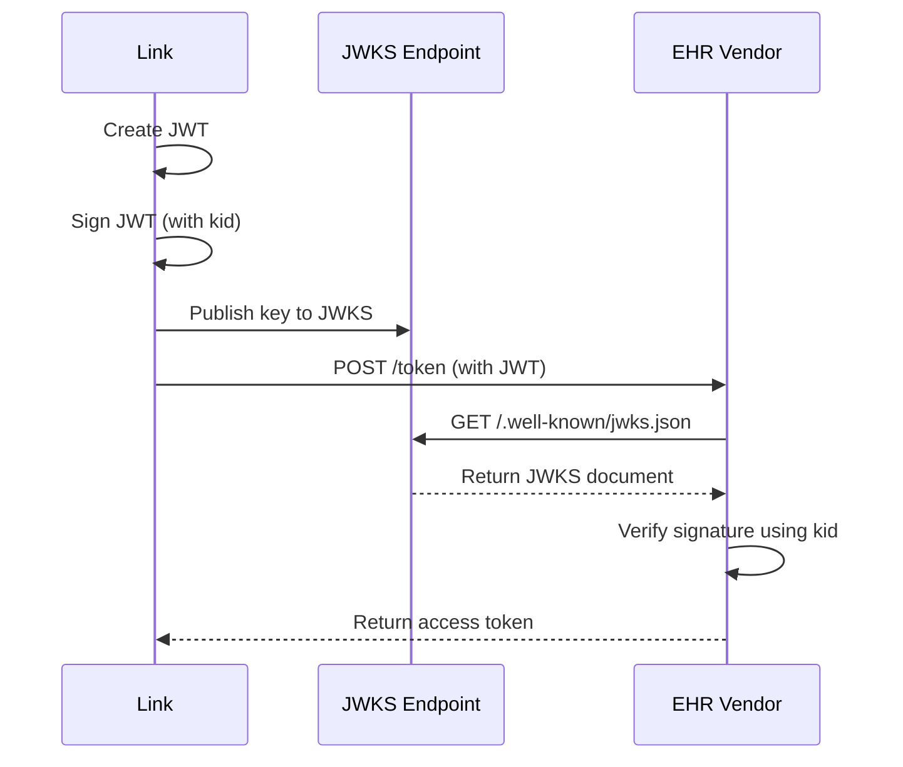

---

id: TenantService
name: Tenant Service
version: 0.2.0

summary: |
  Service that provides functionality for the management of Tenants in the system

owners:
  - arch_team

badges:
  - content: ".NET"
    backgroundColor: gray
    textColor: black
  - content: MSSQL
    backgroundColor: red
    textColor: white
  - content: '8074:8080'
    backgroundColor: gray
    textColor: white

#receives:
    
sends:
  - id: ReportScheduled
  - id: AuditableEventOccurred
  - id: GenerateReportRequested

specifications:
  openapiPath: openapi.yml

---

## Overview

The Tenant service is the entry point for configuring a tenant into Link Cloud. The service is responsible for maintaining and generating events for the scheduled measure reporting periods that the tenant is configured for. These events contain the initial information needed for Link Cloud to query resources and perform measure evaluations based on a specific reporting period.

The Tenant service uses Quartz with ADO Job Stores to manage jobs across multiple instances of the service, primarily for producing ReportScheduled Kafka events.

## Nodes

<NodeGraph />

## Common Configurations

* [Swagger](../config/csharp.md#swagger)
* [Azure App Configuration](../config/csharp.md#azure-app-config-environment-variables)
* [Kafka Configuration](../config/csharp.md#kafka)
* [Service Registry Configuration](../config/csharp.md#service-registry)
* [CORS Configuration](../config/csharp.md#cors)
* [Token Service Configuration](../config/csharp.md#token-service-settings)
* [Service Authentication](../config/csharp.md#service-authentication)
* [SQL Server Database](../config/csharp.md#sql-server-database)

## Custom Configuration

| Name                                | Value         | Secret? |
|-------------------------------------|---------------|---------|
| MeasureConfig__CheckIfMeasureExists | true or false | No      |

## Features and Functionality

### Key Management

Keys are managed independently by the tenant service, and then associated with tenants. These keys are used for signing 
authentication JWTs that are passed to /token endpoints at the EHRs. EHRs check that the JWTs are signed using a key
found in the JWKS endpoint exposed by Link.

* Key Registry: A global repository where all JWT signing keys are stored and managed. Each key includes metadata such as kid, algorithm, creation timestamp, status (active, disabled, expired), and an optional primary flag.
* Lifecycle Operations:
  * Create: Keys can be generated through the admin API/UI with algorithm selection and optional designation as primary.
  * Disable/Delete: Keys no longer in use can be deactivated or removed without disrupting tenant authentication, unless actively in use. This can occur when needing to rotate a key.
  * Rotating Keys:
    1. Create a new key
    2. Associate the new key with tenants
    3. Delete the old key.
* Tenant Association (handled separately):
  * Tenants reference keys by kid through the Tenant Service configuration interface.
  * A tenant may use a shared or unique key from the registry.
  * Changing a tenant’s associated key does not impact the underlying key object—it only changes the reference.
* JWKS documents are managed automatically
  * When keys change the JWKS document is re-generated
  * The JWKS document is stored on the file system
  * The JWKS document on the file system is exposed via proxy to external parties for verification (such as EHRs)

The following sequence diagram illustrates how the keys are used during the authentication requests to EHRs: 

