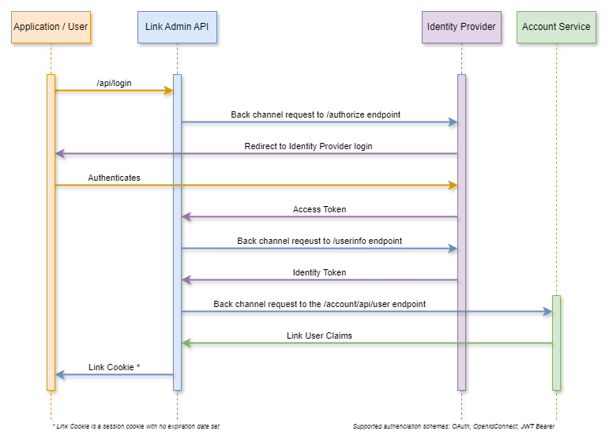

# Security Overview

The Link system implements Role-Based Access Control (RBAC) through a claims-based authorization model. Currently, the system has a single "Admin" role configured which has access to all available permissions.

## Claims/Permissions

The following claims define what actions users can perform in the system:

| Claim                       | Description                                          |
|-----------------------------|------------------------------------------------------|
| CanViewLogs                 | Allows viewing system audit and activity logs        |
| CanViewNotifications        | Allows viewing system notifications and alerts       |
| CanViewTenantConfigurations | Allows viewing tenant configuration settings         |
| CanEditTenantConfigurations | Allows modifying tenant configuration settings       |
| CanAdministerAllTenants     | Grants full administrative access across all tenants |
| CanViewResources            | Allows viewing system resources                      |
| CanViewReports              | Allows viewing generated reports                     |
| CanGenerateReports          | Allows generating new reports                        |
| CanGenerateEvents           | Allows generating system events                      |
| CanViewAccounts             | Allows viewing user accounts                         |
| CanAdministerAccounts       | Allows creating/modifying/deleting user accounts     |
| IsLinkAdmin                 | Designates the user as a system administrator        |

## Roles

Currently, only a single role is configured in the system:

**Admin Role**

- Has access to all claims/permissions listed above
- Full system administrative capabilities
- No tenant-level restrictions

## Implementation

The RBAC system is implemented through:

- Claims defined in `LinkSystemPermissions` enum
- Authorization policies that map to individual claims
- Role and user entities that maintain claim assignments
- Claims-based authorization checks in the application

## Future Considerations

### Expanded Claims

The system is designed to support additional claims, particularly:
- UI-specific permissions for granular interface control
- Additional operational permissions as new features are added
- Workflow-specific permissions

### Additional Roles

Plans for expanding role definitions include:

- Creating non-administrative roles with limited permissions
- Role hierarchies
- Custom role definitions per tenant

### Tenant Restrictions

Future updates will include:

- Tenant-specific role definitions
- User-to-tenant mapping
- Tenant-scoped permissions
- Multi-tenant authorization policies

## Technical Details

The authorization system is built on ASP.NET Core's authorization framework using:

- Policy-based authorization
- Claims-principal based identity
- Role and claim persistence in SQL database
- Cached authorization decisions for performance