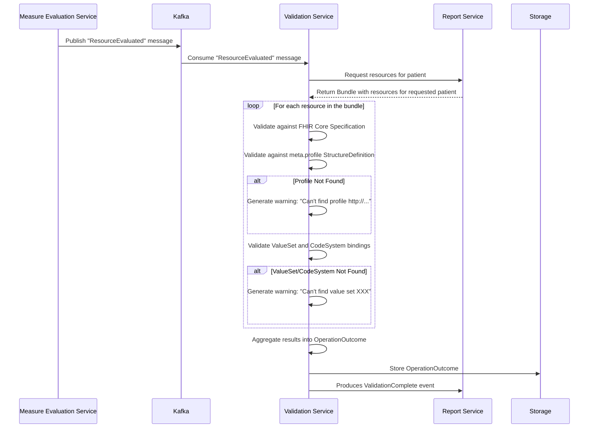

# Validation Service Documentation

## Overview
The **Validation Service** is a component responsible for validating FHIR resources associated with a patient 
after the Measure Evaluation process is complete. It ensures that resources conform to both the core FHIR 
specification and specific StructureDefinitions (profiles) as asserted in the `meta.profile` property of 
each resource.

## Process Flow
1. **Measure Evaluation Completion**
    - The Measure Evaluation Service evaluates a patient.
    - Once evaluation is complete, it produces a Kafka `ResourceEvaluated` message for each resource returned by measure evaluation (including the MeasureReport).

2. **Report Services Persists MeasureReport**
    - The report service consumes `ResourceEvaluated` and persists the resources.
    - When the `MeasureReport` is processed by the Report service, it uses that to determine when it has received and persisted *all* resources.
    - After all resources are persisted, the status of the patient for the submission changes to `ReadyToValidate`.
    - After the status of the patient's submission changes, it produces a `ReadyForValidation` event.

3. **Validation Service Consumption**
    - The Validation Service consumes the Kafka `ReadyForValidation` event.
    - It retrieves the **MeasureReport** for the specified patient from the Report Service.
    - It extracts all contained FHIR resources and constructs a **Bundle** for validation.

4. **Validation Execution**
    - Each resource in the bundle is validated individually.
    - The validation process includes:
        - **FHIR Core Specification Validation**: Ensures compliance with the base FHIR standard.
        - **Profile Validation**: Each resource is checked against the profiles asserted in `meta.profile`.
            - If a required **StructureDefinition** (profile) is missing, a **warning** is generated:  
              *"Can't find profile http://.../us-core-observation"*
        - **ValueSet and CodeSystem Validation**: Ensures that coded elements conform to the expected ValueSets and CodeSystems.
            - If a required **ValueSet** or **CodeSystem** is missing, a **warning** is generated:  
              *"Can't find value set XXX"*
    - All validation results are aggregated into a single **OperationOutcome**, capturing any validation issues.
    - The **OperationOutcome** containing all validation issues is stored for further processing or review.
    - The validation service produces a `ValidationComplete` Kafka event and includes an indication of whether the patient's submission is valid.

## Configuration
The Validation Service supports two types of artifacts that define validation rules:

1. **Package (`package.tgz` format)**
    - A packaged collection of FHIR artifacts (profiles, ValueSets, CodeSystems).

2. **FHIR Resource Artifacts**
    - Individual **StructureDefinitions**, **ValueSets**, and **CodeSystems** can be provided.

## Example: Profile Validation
When the validation service encounters an Observation resource like the following:

```json
{
  "resourceType": "Observation",
  "meta": {
    "profile": ["http://.../us-core-observation"]
  },
  "... other properties"
}
```

It will:

* Validate the resource against the core FHIR specification.
* Validate against the http://.../us-core-observation profile.
* If the profile is missing, generate a warning.

Similarly, for properties bound to a ValueSet or CodeSystem, the service expects these artifacts to be provided. If they are missing, it will issue warnings.

## Sequence Diagram

The following diagram illustrates the relationship between the Measure Evaluation Service, Kafka, and the Validation Service:

